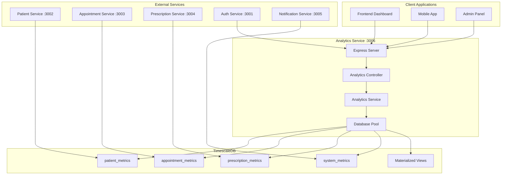
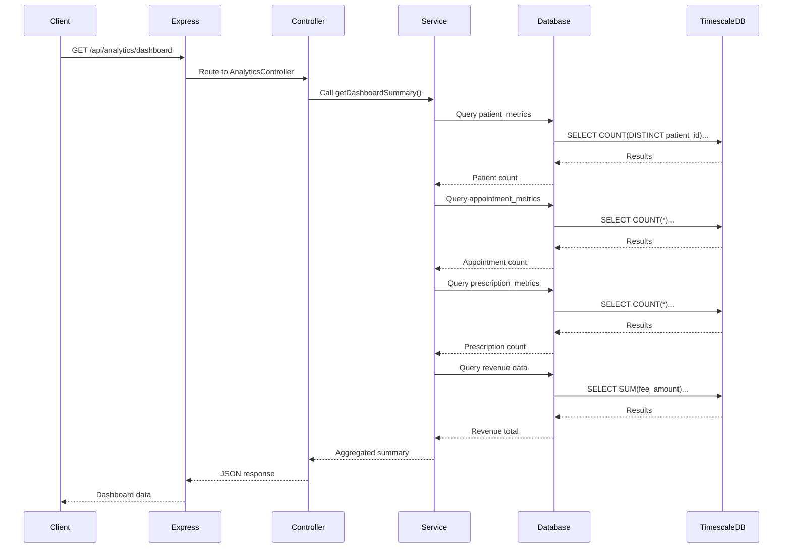
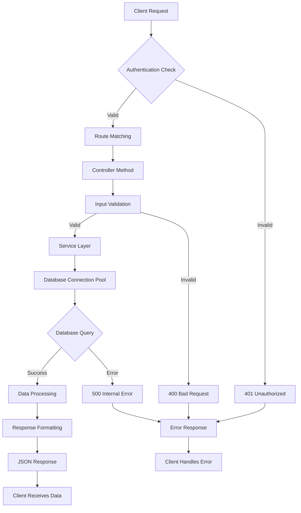
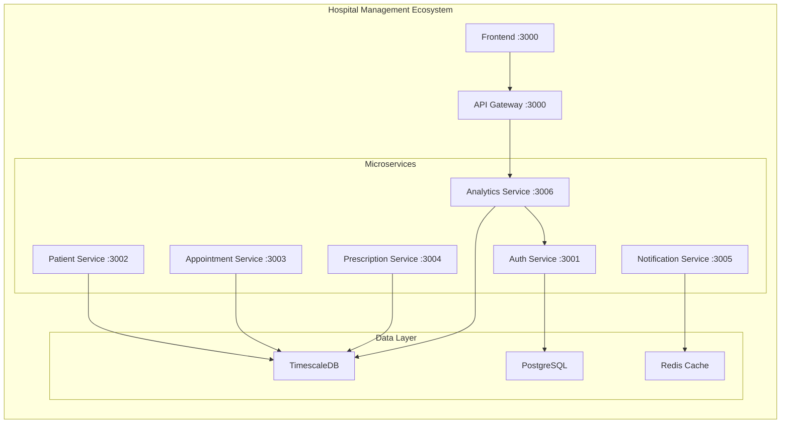
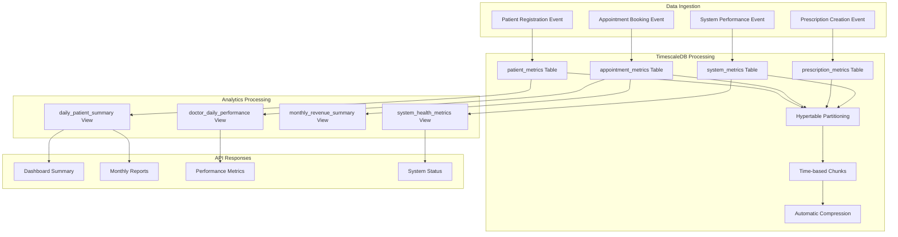
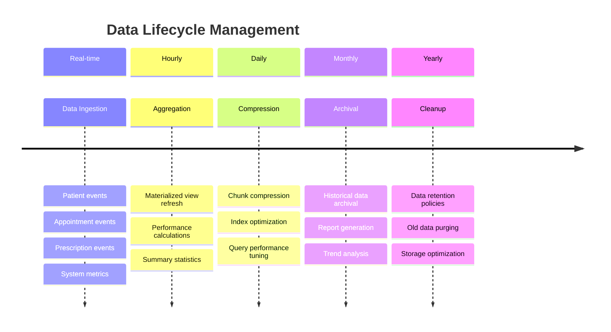
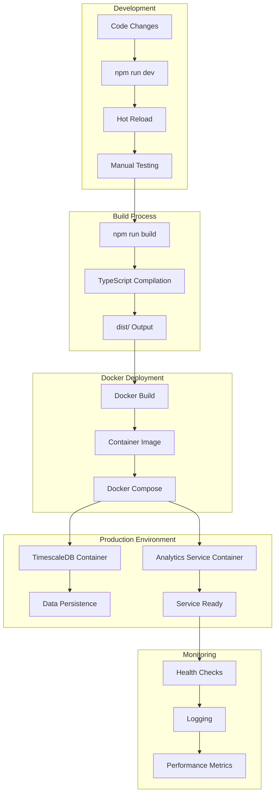
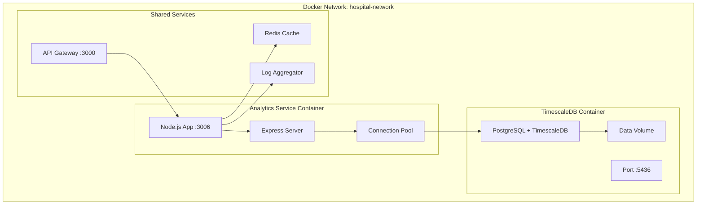

# Analytics Service

**Status**: ✅ FULLY OPERATIONAL - Dashboard & Reporting System Working

Hospital Management System Analytics and Reporting Service built with Node.js, TypeScript, and TimescaleDB.

### ✅ Recent Testing (August 2025)
- **Dashboard API**: Successfully providing real-time analytics data
- **TimescaleDB Connection**: Database connection stable and optimized
- **Data Aggregation**: Patient, appointment, prescription, and revenue statistics working
- **Authentication**: JWT token validation integrated with API Gateway
- **System Integration**: Real-time data from all connected services

## 📊 Overview

The Analytics Service provides comprehensive reporting and statistics for the hospital management system, including patient analytics, prescription reports, appointment statistics, doctor performance metrics, and system monitoring.

## 🔄 System Workflow

### High-Level Architecture Flow



### Request Processing Flow



### Data Flow Architecture

```mermaid
flowchart LR
    subgraph "Data Sources"
        A[Patient Events]
        B[Appointment Events]
        C[Prescription Events]
        D[System Events]
    end
    
    subgraph "TimescaleDB Tables"
        E[patient_metrics]
        F[appointment_metrics]
        G[prescription_metrics]
        H[system_metrics]
    end
    
    subgraph "Processing Layer"
        I[Materialized Views]
        J[Aggregation Functions]
        K[Time-based Partitions]
    end
    
    subgraph "API Endpoints"
        L[/patients/monthly]
        M[/appointments/stats]
        N[/prescriptions/reports]
        O[/dashboard]
        P[/doctors/performance]
    end
    
    A --> E
    B --> F
    C --> G
    D --> H
    
    E --> I
    F --> I
    G --> I
    H --> I
    
    I --> J
    J --> K
    
    K --> L
    K --> M
    K --> N
    K --> O
    K --> P
```

### API Request Lifecycle



### Service Integration Pattern



## 🏗️ Architecture

```
analytics-service/
├── src/
│   ├── controllers/
│   │   └── AnalyticsController.ts    # API request handlers
│   ├── services/
│   │   └── AnalyticsService.ts       # Business logic
│   ├── routes/
│   │   ├── analyticsRoutes.ts        # Analytics endpoints
│   │   └── healthRoutes.ts           # Health check endpoints
│   ├── config/
│   │   └── database.ts               # TimescaleDB connection
│   └── index.ts                      # Main server file
├── package.json
├── tsconfig.json
├── .env
└── README.md
```

## 🚀 Quick Start

### Prerequisites
- Node.js 18+
- TimescaleDB (PostgreSQL with TimescaleDB extension)
- Docker (for database)

### Installation

1. **Install dependencies:**
```bash
npm install
```

2. **Configure environment:**
```bash
cp .env.example .env
# Edit .env with your database credentials
```

3. **Start TimescaleDB:**
```bash
# From project root
docker-compose -f ../docker-compose.yml up -d analytics-db
```

4. **Build and start service:**
```bash
npm run build
npm start
```

## 🔧 Configuration

### Environment Variables

```env
# Server Configuration
PORT=3006
NODE_ENV=development

# Database Configuration (TimescaleDB)
DB_HOST=localhost
DB_PORT=5436
DB_NAME=analytics_service_db
DB_USER=analytics_user
DB_PASSWORD=analytics_password_123

# Service Configuration
SERVICE_NAME=analytics-service
LOG_LEVEL=info

# Other Services URLs
AUTH_SERVICE_URL=http://localhost:3001
PATIENT_SERVICE_URL=http://localhost:3002
APPOINTMENT_SERVICE_URL=http://localhost:3003
PRESCRIPTION_SERVICE_URL=http://localhost:3004
NOTIFICATION_SERVICE_URL=http://localhost:3005

# CORS Configuration
CORS_ORIGIN=http://localhost:3000
```

## 📡 API Endpoints

### Health Check
- `GET /health` - Service health status
- `GET /health/simple` - Simple health check

### Patient Analytics
- `GET /api/analytics/patients/monthly` - Patient statistics by month
  - Query params: `year`, `limit`
  - Returns: Monthly patient registration and visit trends

### Prescription Analytics
- `GET /api/analytics/prescriptions/reports` - Prescription reports
  - Query params: `year`, `limit`
  - Returns: Medication dispensing and cost analysis

### Appointment Analytics
- `GET /api/analytics/appointments/stats` - Appointment statistics
  - Query params: `days`
  - Returns: Scheduling patterns and revenue tracking

### Doctor Performance
- `GET /api/analytics/doctors/performance` - Doctor performance metrics
  - Query params: `doctorId`, `days`
  - Returns: Productivity metrics and patient satisfaction

### System Metrics
- `GET /api/analytics/system/metrics` - System performance metrics
  - Query params: `metricName`, `hours`
  - Returns: API performance and resource utilization

### Dashboard
- `GET /api/analytics/dashboard` - Dashboard summary
  - Returns: Real-time overview of key metrics

### Utilities
- `POST /api/analytics/refresh` - Refresh materialized views
  - Manually refresh pre-computed analytics views

## 📊 Sample API Responses

### Patient Monthly Statistics
```json
{
  "success": true,
  "data": {
    "statistics": [
      {
        "month": "2025-08",
        "year": 2025,
        "new_registrations": 15,
        "total_visits": 45,
        "unique_patients": 12
      }
    ],
    "summary": {
      "total_months": 12,
      "total_new_registrations": 180,
      "total_visits": 540,
      "avg_patients_per_month": 15
    }
  },
  "message": "Patient statistics retrieved successfully"
}
```

### Dashboard Summary
```json
{
  "success": true,
  "data": {
    "summary": {
      "total_patients": 150,
      "total_appointments": 320,
      "total_prescriptions": 280,
      "total_revenue": 15750.00
    },
    "period": "Current month"
  },
  "message": "Dashboard summary retrieved successfully"
}
```

### Prescription Reports
```json
{
  "success": true,
  "data": {
    "reports": [
      {
        "month": "2025-08",
        "year": 2025,
        "total_prescriptions": 45,
        "total_medications": 120,
        "total_cost": 2500.00,
        "completed_prescriptions": 42
      }
    ],
    "summary": {
      "total_months": 6,
      "total_prescriptions": 270,
      "total_medications": 720,
      "total_cost": 15000.00,
      "completion_rate": 93
    }
  },
  "message": "Prescription reports retrieved successfully"
}
```

## 🗄️ Database Schema

### Database Workflow



### Data Retention & Lifecycle



### TimescaleDB Tables

#### Patient Metrics
```sql
CREATE TABLE patient_metrics (
    time TIMESTAMPTZ NOT NULL,
    patient_id UUID NOT NULL,
    metric_type VARCHAR(50) NOT NULL, -- 'registration', 'visit', 'prescription'
    metric_value DECIMAL,
    metadata JSONB,
    hospital_id UUID,
    created_at TIMESTAMPTZ DEFAULT NOW()
);
```

#### Appointment Metrics
```sql
CREATE TABLE appointment_metrics (
    time TIMESTAMPTZ NOT NULL,
    appointment_id UUID,
    doctor_id UUID,
    patient_id UUID,
    event_type VARCHAR(50), -- 'scheduled', 'confirmed', 'completed', 'cancelled'
    duration_minutes INTEGER,
    wait_time_minutes INTEGER,
    fee_amount DECIMAL(10,2),
    metadata JSONB,
    created_at TIMESTAMPTZ DEFAULT NOW()
);
```

#### Prescription Metrics
```sql
CREATE TABLE prescription_metrics (
    time TIMESTAMPTZ NOT NULL,
    prescription_id UUID,
    doctor_id UUID,
    patient_id UUID,
    event_type VARCHAR(50), -- 'created', 'dispensed', 'completed'
    medication_count INTEGER,
    total_cost DECIMAL(10,2),
    metadata JSONB,
    created_at TIMESTAMPTZ DEFAULT NOW()
);
```

### Materialized Views

#### Daily Patient Summary
```sql
CREATE MATERIALIZED VIEW daily_patient_summary AS
SELECT 
    date_trunc('day', time) as day,
    COUNT(DISTINCT patient_id) as unique_patients,
    COUNT(*) as total_events,
    COUNT(*) FILTER (WHERE metric_type = 'registration') as new_registrations,
    COUNT(*) FILTER (WHERE metric_type = 'visit') as visits,
    COUNT(*) FILTER (WHERE metric_type = 'prescription') as prescriptions
FROM patient_metrics
GROUP BY date_trunc('day', time)
ORDER BY day DESC;
```

## 🔄 Data Management

### Data Retention Policies
- **Patient Metrics**: 2 years
- **Appointment Metrics**: 2 years
- **Prescription Metrics**: 2 years
- **System Metrics**: 3 months
- **Doctor Performance**: 2 years
- **Hospital Operational**: 1 year

### Materialized View Refresh
Views are automatically refreshed every 6 hours. Manual refresh:
```bash
curl -X POST http://localhost:3006/api/analytics/refresh
```

### Sample Data
The service includes 30 days of sample data for testing and development.

## 🚀 Performance Features

### TimescaleDB Optimizations
- **Hypertables**: Automatic partitioning by time
- **Chunk Intervals**: Optimized for query patterns
- **Indexes**: Strategic indexing for common queries
- **Compression**: Efficient storage of historical data
- **Retention**: Automatic cleanup of old data

### Query Optimization
- **Connection Pooling**: Efficient database connections
- **Materialized Views**: Pre-computed aggregations
- **Indexed Queries**: Fast lookups by time and ID
- **Batch Processing**: Efficient data insertion

## 🧪 Testing

### Run Tests
```bash
npm test
```

### Manual Testing
```bash
# Health check
curl http://localhost:3006/health

# Patient statistics
curl "http://localhost:3006/api/analytics/patients/monthly?limit=6"

# Dashboard summary
curl http://localhost:3006/api/analytics/dashboard

# Prescription reports
curl "http://localhost:3006/api/analytics/prescriptions/reports?year=2025"
```

## 🔍 Monitoring

### Health Endpoints
- **Detailed**: `GET /health` - Full health status with database connection
- **Simple**: `GET /health/simple` - Basic OK response for load balancers

### Logging
- **Winston**: Structured logging with configurable levels
- **Request Logging**: Morgan middleware for HTTP requests
- **Error Tracking**: Comprehensive error logging

### Metrics
The service tracks its own performance metrics in the `system_metrics` table.

## 🔧 Development

### Scripts
```bash
npm run dev          # Development with hot reload
npm run build        # Build TypeScript
npm start           # Start production server
npm test            # Run tests
npm run lint        # Lint code
npm run clean       # Clean build artifacts
```

### Development Workflow
1. Make changes to TypeScript files
2. Service auto-reloads with `npm run dev`
3. Test endpoints manually or with automated tests
4. Build and deploy with `npm run build && npm start`

## 🐳 Docker

### Deployment Workflow



### Container Architecture



### Using Docker Compose
```bash
# Start analytics database
docker-compose -f ../docker-compose.yml up -d analytics-db

# Check database logs
docker logs hospital-analytics-db

# Connect to database
docker exec -it hospital-analytics-db psql -U analytics_user -d analytics_service_db
```

## 🔧 Troubleshooting

### Common Issues

#### Database Connection Failed
```bash
# Check if TimescaleDB is running
docker ps | grep analytics

# Check database logs
docker logs hospital-analytics-db

# Test connection manually
psql -h localhost -p 5436 -U analytics_user -d analytics_service_db
```

#### Service Won't Start
```bash
# Check port availability
netstat -ano | findstr :3006

# Check environment variables
cat .env

# Check build output
npm run build
```

#### No Data in Analytics
```bash
# Check if sample data exists
curl http://localhost:3006/api/analytics/dashboard

# Refresh materialized views
curl -X POST http://localhost:3006/api/analytics/refresh

# Check database directly
docker exec -it hospital-analytics-db psql -U analytics_user -d analytics_service_db -c "SELECT COUNT(*) FROM patient_metrics;"
```

### Performance Issues
- Check database connection pool settings
- Monitor query execution times
- Review materialized view refresh frequency
- Analyze TimescaleDB chunk intervals

## 📝 Contributing

1. Follow TypeScript best practices
2. Add tests for new features
3. Update API documentation
4. Use conventional commits
5. Ensure proper error handling

## 📄 License

Private - Hospital Management System

---

**Analytics Service v1.0.0** - Comprehensive reporting and statistics for hospital management system.

