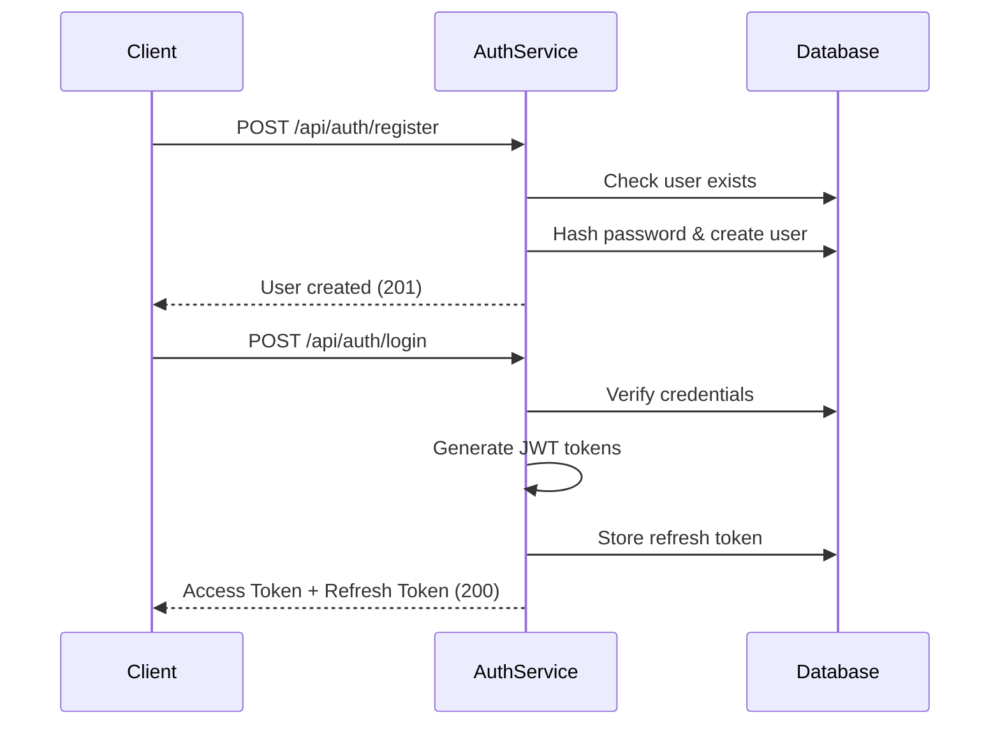
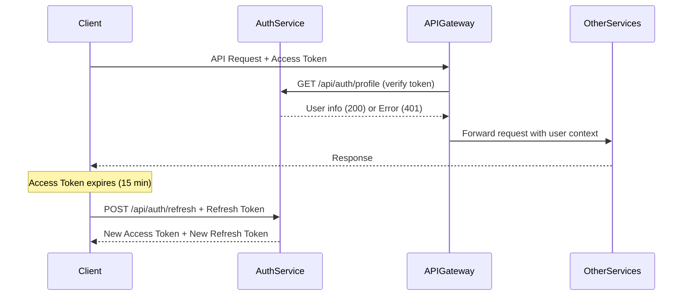

# 🔐 Auth Service - Hospital Management System

**Status**: ✅ FULLY OPERATIONAL | **Version**: 2.0.0 | **Port**: 3001

Auth Service là microservice xử lý xác thực và quản lý người dùng trong hệ thống Hospital Management System. Tích hợp hoàn toàn với API Gateway, cung cấp JWT authentication, role-based access control và user management.

## ⚡ Quick Start

```bash
# 1. Start database
docker-compose up auth-db -d

# 2. Install & build
npm install && npm run build

# 3. Start service
npm start

# 4. Health check
curl http://localhost:3001/health
```

## 🚀 Core Features

### 🔐 Authentication
- **User Registration & Login** với validation đầy đủ
- **JWT Tokens**: Access (15min) + Refresh (7 days) 
- **Password Security**: Bcrypt hashing + strength validation
- **Token Verification**: `/api/auth/profile` endpoint cho API Gateway

### 👥 User Management
- **Profile Management**: CRUD operations cho user profiles
- **Admin Panel**: User management với pagination & filters
- **Role-based Access**: 5 levels (admin, doctor, nurse, staff, patient)
- **Account Control**: Activate/deactivate users

### 🛡️ Security & Integration
- **API Gateway Integration**: Hoàn toàn tích hợp với gateway middleware
- **Rate Limiting**: 100 requests/15min per IP
- **Session Management**: Secure refresh token storage
- **Input Validation**: Comprehensive request validation

## 🛠 Tech Stack

| Component | Technology | Version |
|-----------|------------|---------|
| **Runtime** | Node.js + TypeScript | 18.x+ |
| **Framework** | Express.js | 4.19+ |
| **Database** | PostgreSQL | 15+ |
| **Auth** | JWT + Bcrypt | Latest |
| **Logging** | Winston (via shared) | Latest |

## 📊 Database Schema

```sql
-- Users table
CREATE TABLE users (
    id UUID PRIMARY KEY DEFAULT uuid_generate_v4(),
    username VARCHAR(150) UNIQUE NOT NULL,
    email VARCHAR(254) UNIQUE NOT NULL,
    password_hash VARCHAR(255) NOT NULL,
    role user_role_enum NOT NULL DEFAULT 'patient',
    is_active BOOLEAN DEFAULT TRUE,
    created_at TIMESTAMPTZ DEFAULT NOW(),
    updated_at TIMESTAMPTZ DEFAULT NOW()
);

-- User profiles table  
CREATE TABLE user_profiles (
    id UUID PRIMARY KEY DEFAULT uuid_generate_v4(),
    user_id UUID REFERENCES users(id) ON DELETE CASCADE,
    first_name VARCHAR(100),
    last_name VARCHAR(100),
    phone VARCHAR(15),
    created_at TIMESTAMPTZ DEFAULT NOW()
);

-- User sessions table (refresh tokens)
CREATE TABLE user_sessions (
    id UUID PRIMARY KEY DEFAULT uuid_generate_v4(),
    user_id UUID REFERENCES users(id) ON DELETE CASCADE,
    token_hash VARCHAR(255) NOT NULL,
    expires_at TIMESTAMPTZ NOT NULL,
    created_at TIMESTAMPTZ DEFAULT NOW()
);
```

## 🎭 User Roles & Permissions

### 👤 Role Definitions

| Role | Description | Permissions |
|------|-------------|-------------|
| **admin** | System Administrator | Full system access, user management |
| **doctor** | Medical Doctor | Patient management, prescriptions, appointments |
| **nurse** | Nurse | Limited patient care, view prescriptions |
| **staff** | Administrative Staff | Administrative tasks, basic reports |
| **patient** | Patient | Own profile, appointments, prescriptions |

### 🛡️ API Gateway Integration

Auth Service tích hợp với API Gateway qua token verification:

```typescript
// API Gateway calls Auth Service to verify tokens
GET /api/auth/profile
Authorization: Bearer {token}

// Auth Service response:
{
  "success": true,
  "data": {
    "id": "user-uuid",
    "username": "doctor_john", 
    "role": "doctor",
    "profile": {...}
  }
}
```

## 📋 API Response Format

### 📊 Standard Response Structure

```json
{
  "success": boolean,
  "data": object | array | null,
  "message": string,
  "errors": string[],
  "timestamp": string
}
```

### 🚦 HTTP Status Codes

| Code | Meaning | When | Action |
|------|---------|------|--------|
| 200 | OK | Success | Use response data |
| 201 | Created | Resource created | Save new object info |
| 400 | Bad Request | Validation error | Fix request data |
| 401 | Unauthorized | Invalid/expired token | Login or refresh token |
| 403 | Forbidden | Insufficient permissions | Check user role |
| 404 | Not Found | Resource not found | Verify URL/ID |
| 500 | Server Error | Internal error | Contact admin |

### 📝 Response Examples

**Success Response:**
```json
{
  "success": true,
  "data": {
    "user": {
      "id": "uuid",
      "username": "doctor_john",
      "role": "doctor"
    },
    "accessToken": "jwt_token_here",
    "refreshToken": "refresh_token_here"
  },
  "message": "Login successful"
}
```

**Error Response:**
```json
{
  "success": false,
  "message": "Validation failed",
  "errors": [
    "Email is required",
    "Password must be at least 8 characters"
  ]
}
```

## 🔄 Authentication Flow


2. Token Management Flow



### 🔑 Token Management

**Access Token**: 15 minutes TTL, contains user info
**Refresh Token**: 7 days TTL, stored in database

```javascript
// Token validation example
function isTokenValid(token) {
  try {
    const payload = JSON.parse(atob(token.split('.')[1]));
    return payload.exp * 1000 > Date.now();
  } catch {
    return false;
  }
}
```

## 🌐 API Endpoints

### 🔐 Authentication Routes (`/api/auth`)

| Method | Endpoint | Description | Auth Required |
|--------|----------|-------------|---------------|
| `POST` | `/register` | User registration | ❌ |
| `POST` | `/login` | User login | ❌ |
| `POST` | `/refresh` | Refresh access token | ❌ |
| `GET` | `/profile` | Get user profile | ✅ |
| `PUT` | `/profile` | Update user profile | ✅ |
| `POST` | `/logout` | Logout user | ✅ |
| `POST` | `/change-password` | Change password | ✅ |

### 👥 User Management Routes (`/api/users`) - Admin Only

| Method | Endpoint | Description | Role Required |
|--------|----------|-------------|---------------|
| `GET` | `/` | List users (paginated) | Admin |
| `GET` | `/:id` | Get user by ID | Admin |
| `POST` | `/` | Create new user | Admin |
| `PUT` | `/:id` | Update user | Admin |
| `DELETE` | `/:id` | Delete user | Admin |
| `POST` | `/:id/activate` | Activate user | Admin |
| `POST` | `/:id/deactivate` | Deactivate user | Admin |

### 📝 Key Request/Response Examples

#### Register User
```bash
POST /api/auth/register
{
  "username": "doctor_john",
  "email": "john@hospital.com",
  "password": "SecurePass123!",
  "role": "doctor"
}
```

#### Login
```bash
POST /api/auth/login
{
  "email": "john@hospital.com", 
  "password": "SecurePass123!"
}

# Response:
{
  "success": true,
  "data": {
    "user": {...},
    "accessToken": "jwt_token_here",
    "refreshToken": "refresh_token_here"
  }
}
```

#### Get Profile (Token Verification)
```bash
GET /api/auth/profile
Authorization: Bearer {access_token}

# Used by API Gateway to verify tokens
```

## 🧪 Testing Examples

### Health Check
```bash
curl http://localhost:3001/health
```

### User Registration
```bash
curl -X POST http://localhost:3001/api/auth/register \
  -H "Content-Type: application/json" \
  -d '{
    "username": "doctor_john",
    "email": "john@hospital.com", 
    "password": "SecurePass123!",
    "role": "doctor"
  }'
```

### Login & Get Tokens
```bash
curl -X POST http://localhost:3001/api/auth/login \
  -H "Content-Type: application/json" \
  -d '{
    "email": "john@hospital.com",
    "password": "SecurePass123!"
  }'
```

### Use Token for Protected Routes
```bash
export TOKEN="your_access_token_here"

curl -X GET http://localhost:3001/api/auth/profile \
  -H "Authorization: Bearer $TOKEN"
```

### Admin Operations
```bash
# Get users list (Admin only)
curl -X GET "http://localhost:3001/api/users?page=1&limit=5" \
  -H "Authorization: Bearer $ADMIN_TOKEN"

# Create new user (Admin only)
curl -X POST http://localhost:3001/api/users \
  -H "Authorization: Bearer $ADMIN_TOKEN" \
  -H "Content-Type: application/json" \
  -d '{
    "username": "nurse_mary",
    "email": "mary@hospital.com",
    "role": "nurse"
  }'
```

## ⚙️ Configuration

### Environment Variables
```env
# Server
NODE_ENV=development
PORT=3001

# Database
AUTH_DB_HOST=localhost
AUTH_DB_PORT=5432
AUTH_DB_NAME=auth_service_db
AUTH_DB_USER=auth_user
AUTH_DB_PASSWORD=auth_password_123

# JWT
JWT_SECRET=your-super-secret-jwt-key-here
JWT_REFRESH_SECRET=your-super-secret-refresh-key-here

# Security
RATE_LIMIT_MAX=100
ALLOWED_ORIGINS=http://localhost:3000
```

## 📁 Project Structure

```
auth-service/
├── src/
│   ├── controllers/          # Request handlers
│   │   ├── AuthController.ts
│   │   └── UserController.ts
│   ├── services/            # Business logic
│   │   ├── AuthService.ts
│   │   └── UserService.ts
│   ├── middleware/          # Express middleware
│   │   ├── auth.ts         # JWT authentication
│   │   ├── errorHandler.ts # Error handling
│   │   └── requestLogger.ts # Request logging
│   ├── routes/             # API routes
│   │   ├── auth.ts
│   │   └── users.ts
│   └── index.ts            # Application entry point
├── dist/                   # Compiled JavaScript
├── logs/                   # Log files
└── package.json
```

## 🔧 Development Scripts

```bash
# Install dependencies
npm install

# Build project
npm run build

# Start service
npm start

# Development mode
npm run dev

# Run tests
npm test
```

## 🐛 Common Issues & Solutions

### Database Connection Error
```bash
# Check if database is running
docker ps | grep auth-db

# Start database
docker-compose up auth-db -d

# Test connection
docker exec -it hospital-auth-db psql -U auth_user -d auth_service_db -c "SELECT 1;"
```

### Token Issues
```bash
# Check JWT secret
echo $JWT_SECRET

# Clear tokens and re-login
localStorage.clear();

# Verify token format (should have 3 parts)
echo "TOKEN" | awk -F. '{print NF-1}' # Should output 2
```

### Rate Limiting
```bash
# Check rate limit headers
curl -I http://localhost:3001/api/auth/login

# Increase limit in .env
RATE_LIMIT_MAX=500
```

## 📊 Performance & Monitoring

### Health Check
```bash
curl http://localhost:3001/health

# Response:
{
  "status": "healthy",
  "service": "auth-service",
  "uptime": 143.37
}
```

### Metrics
- **Target Response Time**: < 200ms
- **Target Uptime**: 99.9%
- **Rate Limit**: 100 requests/15min per IP
- **Token TTL**: Access (15min), Refresh (7 days)

## 📝 Changelog

### v2.0.0 (Current)
- ✅ Complete authentication system
- ✅ JWT token management with refresh
- ✅ Role-based access control (5 levels)
- ✅ API Gateway integration
- ✅ User profile management
- ✅ Admin user management
- ✅ Security features (rate limiting, password hashing)
- ✅ Comprehensive error handling

### Upcoming Features
- 🔄 Password reset via email
- 🔄 Two-factor authentication
- 🔄 OAuth2 integration
- 🔄 Enhanced audit logging

---

**🔐 Auth Service v2.0.0** - Hospital Management System  
🏥 **Developed with ❤️ by Hospital Management Team**

### 🔗 Important Links
- **Health Check**: `http://localhost:3001/health`
- **Token Verification**: `http://localhost:3001/api/auth/profile`
- **API Gateway Integration**: Complete token validation service

*Last updated: August 9, 2025*
