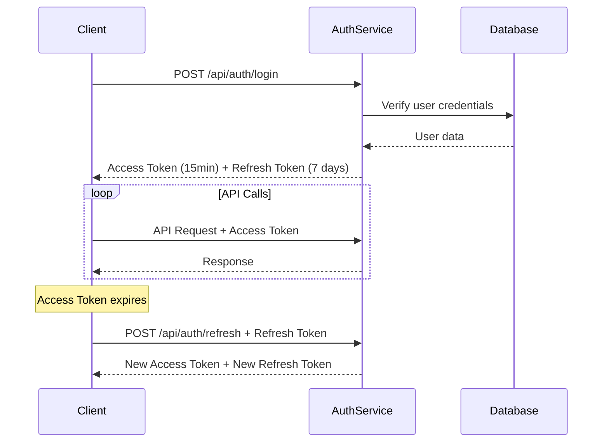

# 🔐 Auth Service - Hospital Management System v1.0.0

## 📋 Mô tả

Auth Service là microservice chịu trách nhiệm xác thực và quản lý người dùng trong hệ thống Quản lý Bệnh viện. Service này cung cấp đầy đủ các chức năng đăng nhập, đăng ký, quản lý JWT token và phân quyền người dùng. Được tích hợp hoàn toàn với API Gateway để cung cấp bảo mật toàn diện cho toàn bộ hệ thống.

## 🚀 Tính năng chính

### 🔐 Xác thực (Authentication)
- **Đăng ký người dùng**: Tạo tài khoản mới với validation đầy đủ
- **Đăng nhập**: Xác thực và tạo JWT token
- **Đăng xuất**: Vô hiệu hóa refresh token
- **Refresh Token**: Làm mới access token tự động
- **Đổi mật khẩu**: Thay đổi mật khẩu an toàn
- **Token Verification**: Endpoint `/api/auth/profile` để verify token từ API Gateway
- **Quên mật khẩu**: Reset mật khẩu qua email (TODO)

### 👥 Quản lý người dùng (User Management)  
- **Profile**: Xem và cập nhật thông tin cá nhân
- **CRUD Users**: Quản lý danh sách người dùng (Admin)
- **Role Management**: Phân quyền theo vai trò
- **User Activation/Deactivation**: Kích hoạt/vô hiệu hóa tài khoản

### 🛡️ Bảo mật & Tích hợp
- **JWT Authentication**: Access token (15 phút) + Refresh token (7 ngày)
- **Password Hashing**: Bcrypt với salt rounds
- **Role-based Access Control**: Phân quyền theo vai trò (Admin, Staff, Doctor, Patient)
- **Session Management**: Quản lý phiên đăng nhập
- **API Gateway Integration**: Tích hợp hoàn toàn với API Gateway middleware
- **Token Validation Service**: Cung cấp token verification cho các microservices khác

## 🛠 Công nghệ sử dụng

- **Runtime**: Node.js + TypeScript
- **Framework**: Express.js
- **Database**: PostgreSQL  
- **Authentication**: JWT (jsonwebtoken)
- **Password**: Bcrypt
- **Validation**: Custom validation functions
- **Logging**: Winston logger
- **Environment**: dotenv

## 📊 Database Schema

### Users Table
```sql
CREATE TABLE users (
    id UUID PRIMARY KEY DEFAULT uuid_generate_v4(),
    username VARCHAR(150) UNIQUE NOT NULL,
    email VARCHAR(254) UNIQUE NOT NULL,
    password_hash VARCHAR(255) NOT NULL,
    role user_role_enum NOT NULL DEFAULT 'patient',
    hospital_id UUID,
    is_active BOOLEAN DEFAULT TRUE,
    is_verified BOOLEAN DEFAULT FALSE,
    created_at TIMESTAMPTZ DEFAULT NOW(),
    updated_at TIMESTAMPTZ DEFAULT NOW(),
    last_login TIMESTAMPTZ
);
```

### User Profiles Table
```sql
CREATE TABLE user_profiles (
    id UUID PRIMARY KEY DEFAULT uuid_generate_v4(),
    user_id UUID REFERENCES users(id) ON DELETE CASCADE,
    first_name VARCHAR(100),
    last_name VARCHAR(100),
    phone VARCHAR(15),
    date_of_birth DATE,
    address TEXT,
    avatar_url VARCHAR(500),
    created_at TIMESTAMPTZ DEFAULT NOW(),
    updated_at TIMESTAMPTZ DEFAULT NOW()
);
```

### User Sessions Table
```sql
CREATE TABLE user_sessions (
    id UUID PRIMARY KEY DEFAULT uuid_generate_v4(),
    user_id UUID REFERENCES users(id) ON DELETE CASCADE,
    token_hash VARCHAR(255) NOT NULL,
    expires_at TIMESTAMPTZ NOT NULL,
    ip_address INET,
    user_agent TEXT,
    created_at TIMESTAMPTZ DEFAULT NOW()
);
```

## 🎭 Vai trò người dùng & Phân quyền

### 👤 Định nghĩa vai trò

```typescript
enum UserRole {
  PATIENT = 'patient',     // Bệnh nhân - Có thể xem lịch hẹn, đơn thuốc của mình
  DOCTOR = 'doctor',       // Bác sĩ - Quản lý bệnh nhân, tạo đơn thuốc, lịch hẹn
  NURSE = 'nurse',         // Y tá - Hỗ trợ chăm sóc bệnh nhân
  STAFF = 'staff',         // Nhân viên - Quản lý thông tin hành chính
  ADMIN = 'admin'          // Quản trị viên - Toàn quyền quản lý hệ thống
}
```

### 🔐 Ma trận quyền hạn theo vai trò

| Vai trò | Auth Management | User Management | Profile | Patients | Appointments | Prescriptions | Analytics |
|---------|----------------|-----------------|---------|----------|--------------|---------------|-----------|
| **PATIENT** | ✅ Own profile | ❌ | ✅ Own | ❌ | ✅ Own | ✅ Own | ❌ |
| **DOCTOR** | ✅ Own profile | ❌ | ✅ Own | ✅ Assigned | ✅ Assigned | ✅ Create/Edit | ✅ Own performance |
| **NURSE** | ✅ Own profile | ❌ | ✅ Own | ✅ Limited | ✅ Limited | ✅ View | ❌ |
| **STAFF** | ✅ Own profile | ❌ | ✅ Own | ✅ CRUD | ✅ CRUD | ✅ View | ✅ Basic reports |
| **ADMIN** | ✅ Full | ✅ Full | ✅ All | ✅ Full | ✅ Full | ✅ Full | ✅ Full access |

### 🛡️ API Gateway Integration

Auth Service được tích hợp với API Gateway thông qua:

```typescript
// API Gateway sử dụng Auth Service để verify token
GET /api/auth/profile
Authorization: Bearer {token}

// Response từ Auth Service:
{
  "success": true,
  "data": {
    "id": "user-uuid",
    "username": "doctor_john",
    "email": "john@hospital.com",
    "role": "doctor",
    "profile": {...}
  }
}
```

### 🔒 Secure Endpoints Examples

Auth Service cung cấp token validation cho các secure endpoints:

```typescript
// API Gateway middleware sử dụng Auth Service
const authenticate = async (req, res, next) => {
  const response = await fetch(`${AUTH_SERVICE_URL}/api/auth/profile`, {
    headers: { 'Authorization': req.headers.authorization }
  });
  
  if (response.ok) {
    const userData = await response.json();
    req.user = userData.data;
    next();
  } else {
    res.status(401).json({ message: 'Invalid token' });
  }
};
```

## 📋 HTTP Status Codes & Response Patterns

### 📊 Standard Response Format

Tất cả API responses đều tuân theo format sau:

```json
{
  "success": boolean,
  "data": object | array | null,
  "message": string,
  "errors": string[],
  "meta": {
    "pagination": object,
    "timestamp": string
  },
  "timestamp": string
}
```

### 🚦 HTTP Status Codes

| Status Code | Ý nghĩa | Khi nào xảy ra | Action cần thực hiện |
|-------------|---------|----------------|---------------------|
| 200 | OK | Request thành công | Sử dụng data từ response |
| 201 | Created | Tài nguyên mới được tạo | Lưu thông tin object mới |
| 400 | Bad Request | Validation lỗi, request sai format | Fix request data theo errors array |
| 401 | Unauthorized | Token không có/sai/hết hạn | Redirect đến login hoặc refresh token |
| 403 | Forbidden | Không đủ quyền truy cập | Hiện thông báo lỗi quyền hạn |
| 404 | Not Found | Resource không tồn tại | Kiểm tra URL hoặc ID |
| 409 | Conflict | Dữ liệu trung lập (email đã tồn tại) | Thay đổi dữ liệu input |
| 429 | Too Many Requests | Quá nhiều requests | Đợi và thử lại |
| 500 | Internal Server Error | Lỗi server | Liên hệ admin, thử lại sau |

### 🔍 Response Examples by Status

#### ✅ Success Responses

**GET Request Success (200):**
```json
{
  "success": true,
  "data": {
    "id": "uuid",
    "username": "john_doe"
  },
  "timestamp": "2025-08-06T22:46:32.445Z"
}
```

**POST Request Success (201):**
```json
{
  "success": true,
  "data": {
    "user": {
      "id": "new-uuid",
      "email": "new@hospital.com"
    }
  },
  "message": "User created successfully",
  "timestamp": "2025-08-06T22:46:32.445Z"
}
```

**List with Pagination (200):**
```json
{
  "success": true,
  "data": {
    "users": [...],
    "pagination": {
      "page": 1,
      "limit": 10,
      "total": 45,
      "totalPages": 5,
      "hasNext": true,
      "hasPrev": false
    }
  },
  "timestamp": "2025-08-06T22:46:32.445Z"
}
```

#### ❌ Error Responses

**Validation Error (400):**
```json
{
  "success": false,
  "message": "Validation failed",
  "errors": [
    "Email is required",
    "Password must be at least 8 characters"
  ],
  "timestamp": "2025-08-06T22:46:32.445Z"
}
```

**Authentication Error (401):**
```json
{
  "success": false,
  "message": "Token expired",
  "timestamp": "2025-08-06T22:46:32.445Z"
}
```

**Authorization Error (403):**
```json
{
  "success": false,
  "message": "Insufficient permissions. Admin role required.",
  "timestamp": "2025-08-06T22:46:32.445Z"
}
```

**Not Found Error (404):**
```json
{
  "success": false,
  "message": "User not found",
  "timestamp": "2025-08-06T22:46:32.445Z"
}
```

**Server Error (500):**
```json
{
  "success": false,
  "message": "Internal server error",
  "timestamp": "2025-08-06T22:46:32.445Z"
}
```

## 🔐 Authentication Flow Patterns

### 🔄 Complete Authentication Workflow

```
1. User Registration/Login
   ↓
2. Server validates credentials
   ↓  
3. Server generates JWT tokens
   ↓
4. Client stores tokens securely
   ↓
5. Client includes Access Token in requests
   ↓
6. Server validates token on each request
   ↓
7. When Access Token expires → Use Refresh Token
   ↓
8. Get new tokens → Continue requests
```

### 🔑 Token Security Best Practices

#### Client-side Storage
```javascript
// ✅ Good: Secure storage
const accessToken = localStorage.getItem('accessToken');
const refreshToken = localStorage.getItem('refreshToken'); // HttpOnly cookie is better

// ❌ Bad: Insecure
const token = document.cookie; // XSS vulnerable
const token = sessionStorage; // Less secure
```

#### Token Validation
```javascript
// Always check token before API calls
function isTokenValid(token) {
  if (!token) return false;
  
  try {
    const payload = JSON.parse(atob(token.split('.')[1]));
    return payload.exp * 1000 > Date.now();
  } catch {
    return false;
  }
}
```

## 🌐 API Endpoints

### Authentication Routes (`/api/auth`)

#### 1. Đăng ký người dùng mới
**POST** `/api/auth/register`

Tạo tài khoản người dùng mới trong hệ thống.

**Request Headers:**
```
Content-Type: application/json
```

**Request Body:**
```json
{
  "username": "string (required, 3-50 chars, unique)",
  "email": "string (required, valid email format, unique)",
  "password": "string (required, min 8 chars, 1 uppercase, 1 lowercase, 1 number, 1 special char)",
  "role": "string (optional, default: 'patient')", 
  "fullName": "string (optional)",
  "phoneNumber": "string (optional)"
}
```

**Response Success (201):**
```json
{
  "success": true,
  "data": {
    "user": {
      "id": "uuid",
      "username": "string",
      "email": "string",
      "role": "patient|doctor|nurse|staff|admin",
      "isActive": true,
      "createdAt": "2025-08-06T22:46:20.183Z",
      "updatedAt": "2025-08-06T22:46:20.183Z"
    }
  },
  "message": "User registered successfully",
  "timestamp": "2025-08-06T22:46:20.183Z"
}
```

**Response Error (400):**
```json
{
  "success": false,
  "message": "Validation failed",
  "errors": [
    "Username is required",
    "Username must be between 3 and 50 characters",
    "Email must be a valid email address", 
    "Email is already registered",
    "Password must be at least 8 characters long",
    "Password must contain at least one uppercase letter",
    "Password must contain at least one lowercase letter", 
    "Password must contain at least one number",
    "Password must contain at least one special character (!@#$%^&*)",
    "Role must be one of: patient, doctor, nurse, staff, admin"
  ],
  "timestamp": "2025-08-06T22:46:20.183Z"
}
```

**Response Error (409 - Conflict):**
```json
{
  "success": false,
  "message": "User with this email or username already exists",
  "timestamp": "2025-08-06T22:46:20.183Z"
}
```

**Validation Rules:**
- **username**: 3-50 ký tự, chỉ chứa a-z, A-Z, 0-9, underscore, dấu chấm
- **email**: Format email hợp lệ, unique trong hệ thống
- **password**: Tối thiểu 8 ký tự, phải có: 1 chữ hoa, 1 chữ thường, 1 số, 1 ký tự đặc biệt
- **role**: Một trong các giá trị: patient, doctor, nurse, staff, admin
- **fullName**: Tùy chọn, tối đa 200 ký tự
- **phoneNumber**: Tùy chọn, format số điện thoại hợp lệ

---

#### 2. Đăng nhập
**POST** `/api/auth/login`

Xác thực người dùng và tạo JWT tokens.

**Request Headers:**
```
Content-Type: application/json
```

**Request Body:**
```json
{
  "email": "string (required)",
  "password": "string (required)"
}
```

**Response Success (200):**
```json
{
  "success": true,
  "data": {
    "user": {
      "id": "uuid",
      "username": "string",
      "email": "string",
      "role": "patient|doctor|nurse|staff|admin",
      "profile": {
        "id": "uuid",
        "userId": "uuid",
        "firstName": "string",
        "lastName": "string", 
        "phone": "string"
      },
      "isActive": true,
      "createdAt": "datetime",
      "updatedAt": "datetime"
    },
    "accessToken": "jwt_access_token_here (expires in 15 minutes)",
    "refreshToken": "jwt_refresh_token_here (expires in 7 days)"
  },
  "message": "Login successful",
  "timestamp": "2025-08-06T22:46:32.445Z"
}
```

**Response Error (400):**
```json
{
  "success": false,
  "message": "Invalid email or password",
  "timestamp": "2025-08-06T22:46:32.445Z"
}
```

**Response Error (401 - Account Issues):**
```json
{
  "success": false,
  "message": "Account is deactivated. Please contact administrator.",
  "timestamp": "2025-08-06T22:46:32.445Z"
}
```

**Response Error (429 - Too Many Requests):**
```json
{
  "success": false,
  "message": "Too many login attempts. Please try again in 15 minutes.",
  "timestamp": "2025-08-06T22:46:32.445Z"
}
```

**Login Security Features:**
- Rate limiting: Tối đa 5 lần đăng nhập sai trong 15 phút
- Account lockout: Tài khoản bị khóa tạm thời sau 10 lần thử sai
- Password hashing: Bcrypt với salt rounds = 12
- Audit logging: Ghi log tất cả các lần đăng nhập

---

#### 3. Làm mới token
**POST** `/api/auth/refresh`

Sử dụng refresh token để lấy access token mới.

**Request Headers:**
```
Content-Type: application/json
```

**Request Body:**
```json
{
  "refreshToken": "string (required)"
}
```

**Response Success (200):**
```json
{
  "success": true,
  "data": {
    "user": {
      "id": "uuid",
      "username": "string",
      "email": "string",
      "role": "string"
    },
    "accessToken": "new_jwt_access_token",
    "refreshToken": "new_jwt_refresh_token"
  },
  "message": "Token refreshed successfully",
  "timestamp": "2025-08-06T22:46:32.445Z"
}
```

**Response Error (401):**
```json
{
  "success": false,
  "message": "Invalid refresh token",
  "timestamp": "2025-08-06T22:46:32.445Z"
}
```

**Response Error (401 - Token Expired):**
```json
{
  "success": false,
  "message": "Refresh token has expired",
  "timestamp": "2025-08-06T22:46:32.445Z"
}
```

**Token Refresh Notes:**
- Refresh token có thời hạn 7 ngày
- Mỗi lần refresh sẽ tạo ra cả access token VÀ refresh token mới
- Refresh token cũ sẽ bị vô hiệu hóa
- Client nên lưu cả 2 token mới từ response

---

#### 4. Xem profile cá nhân
**GET** `/api/auth/profile`

Lấy thông tin profile của người dùng hiện tại.

**Request Headers:**
```
Authorization: Bearer {access_token}
Content-Type: application/json
```

**Response Success (200):**
```json
{
  "success": true,
  "data": {
    "id": "uuid",
    "username": "string",
    "email": "string",
    "role": "patient|doctor|nurse|staff|admin",
    "profile": {
      "id": "uuid",
      "userId": "uuid",
      "firstName": "string",
      "lastName": "string",
      "phone": "string"
    },
    "isActive": true,
    "createdAt": "datetime",
    "updatedAt": "datetime"
  },
  "timestamp": "2025-08-06T22:46:32.445Z"
}
```

**Response Error (401):**
```json
{
  "success": false,
  "message": "No token provided",
  "timestamp": "2025-08-06T22:46:32.445Z"
}
```

**Response Error (401 - Invalid Token):**
```json
{
  "success": false,
  "message": "Invalid token",
  "timestamp": "2025-08-06T22:46:32.445Z"
}
```

**Response Error (401 - Token Expired):**
```json
{
  "success": false,
  "message": "Token expired",
  "timestamp": "2025-08-06T22:46:32.445Z"
}
```

**Profile Notes:**
- Profile có thể null nếu user chưa cập nhật thông tin
- Chỉ trả về thông tin của user hiện tại (security)
- Token được validate qua JWT middleware

---

#### 5. Cập nhật profile
**PUT** `/api/auth/profile`

Cập nhật thông tin profile của người dùng hiện tại.

**Request Headers:**
```
Authorization: Bearer {access_token}
Content-Type: application/json
```

**Request Body:**
```json
{
  "username": "string (optional)",
  "email": "string (optional)",
  "profile": {
    "firstName": "string (optional)",
    "lastName": "string (optional)",
    "phone": "string (optional)"
  }
}
```

**Response Success (200):**
```json
{
  "success": true,
  "data": {
    "id": "uuid",
    "username": "updated_username",
    "email": "updated_email@example.com",
    "role": "string",
    "profile": {
      "firstName": "Updated Name",
      "lastName": "Updated LastName",
      "phone": "0123456789"
    },
    "isActive": true,
    "updatedAt": "2025-08-06T22:50:32.445Z"
  },
  "message": "Profile updated successfully",
  "timestamp": "2025-08-06T22:50:32.445Z"
}
```

---

#### 6. Đăng xuất
**POST** `/api/auth/logout`

Vô hiệu hóa refresh token hiện tại.

**Request Headers:**
```
Authorization: Bearer {access_token}
Content-Type: application/json
```

**Request Body:**
```json
{
  "refreshToken": "string (required)"
}
```

**Response Success (200):**
```json
{
  "success": true,
  "message": "Logged out successfully",
  "timestamp": "2025-08-06T22:46:32.445Z"
}
```

---

#### 7. Đổi mật khẩu
**POST** `/api/auth/change-password`

Thay đổi mật khẩu cho người dùng đã đăng nhập.

**Request Headers:**
```
Authorization: Bearer {access_token}
Content-Type: application/json
```

**Request Body:**
```json
{
  "currentPassword": "string (required)",
  "newPassword": "string (required, min 8 chars, 1 uppercase, 1 lowercase, 1 number, 1 special char)"
}
```

**Response Success (200):**
```json
{
  "success": true,
  "message": "Password changed successfully",
  "timestamp": "2025-08-06T22:46:32.445Z"
}
```

**Response Error (400):**
```json
{
  "success": false,
  "message": "Current password is incorrect",
  "timestamp": "2025-08-06T22:46:32.445Z"
}
```

### User Management Routes (`/api/users`)

#### 1. Lấy danh sách người dùng (Admin only)
**GET** `/api/users`

Lấy danh sách tất cả người dùng với phân trang và filter.

**Request Headers:**
```
Authorization: Bearer {admin_access_token}
```

**Query Parameters:**
```
page: number (optional, default: 1)
limit: number (optional, default: 10, max: 100)
search: string (optional, search in username/email)
role: string (optional, filter by role)
isActive: boolean (optional, filter by active status)
```

**Example Request:**
```
GET /api/users?page=1&limit=10&search=john&role=doctor&isActive=true
```

**Response Success (200):**
```json
{
  "success": true,
  "data": {
    "users": [
      {
        "id": "uuid",
        "username": "john_doctor",
        "email": "john@hospital.com",
        "role": "doctor",
        "profile": {
          "firstName": "John",
          "lastName": "Doe",
          "phone": "0123456789"
        },
        "isActive": true,
        "createdAt": "datetime",
        "updatedAt": "datetime"
      }
    ],
    "pagination": {
      "page": 1,
      "limit": 10,
      "total": 25,
      "totalPages": 3,
      "hasNext": true,
      "hasPrev": false
    }
  },
  "timestamp": "2025-08-06T22:46:32.445Z"
}
```

---

#### 2. Lấy thông tin người dùng theo ID (Admin only)
**GET** `/api/users/{userId}`

**Request Headers:**
```
Authorization: Bearer {admin_access_token}
```

**Response Success (200):**
```json
{
  "success": true,
  "data": {
    "id": "uuid",
    "username": "john_doctor",
    "email": "john@hospital.com",
    "role": "doctor",
    "profile": {
      "firstName": "John",
      "lastName": "Doe",
      "phone": "0123456789"
    },
    "isActive": true,
    "createdAt": "datetime",
    "updatedAt": "datetime"
  },
  "timestamp": "2025-08-06T22:46:32.445Z"
}
```

---

#### 3. Tạo người dùng mới (Admin only)
**POST** `/api/users`

**Request Headers:**
```
Authorization: Bearer {admin_access_token}
Content-Type: application/json
```

**Request Body:**
```json
{
  "username": "string (required)",
  "email": "string (required)", 
  "password": "string (optional, auto-generated if not provided)",
  "role": "string (required)",
  "profile": {
    "firstName": "string (optional)",
    "lastName": "string (optional)",
    "phone": "string (optional)"
  },
  "isActive": "boolean (optional, default: true)"
}
```

**Response Success (201):**
```json
{
  "success": true,
  "data": {
    "id": "uuid",
    "username": "new_user",
    "email": "newuser@hospital.com",
    "role": "staff",
    "isActive": true,
    "createdAt": "datetime",
    "updatedAt": "datetime"
  },
  "message": "User created successfully",
  "timestamp": "2025-08-06T22:46:32.445Z"
}
```

---

#### 4. Cập nhật người dùng (Admin only)
**PUT** `/api/users/{userId}`

**Request Headers:**
```
Authorization: Bearer {admin_access_token}
Content-Type: application/json
```

**Request Body:**
```json
{
  "username": "string (optional)",
  "email": "string (optional)",
  "role": "string (optional)",
  "isActive": "boolean (optional)"
}
```

**Response Success (200):**
```json
{
  "success": true,
  "data": {
    "id": "uuid",
    "username": "updated_username",
    "email": "updated@hospital.com",
    "role": "nurse",
    "isActive": true,
    "updatedAt": "2025-08-06T22:50:32.445Z"
  },
  "message": "User updated successfully",
  "timestamp": "2025-08-06T22:50:32.445Z"
}
```

---

#### 5. Xóa người dùng (Admin only)
**DELETE** `/api/users/{userId}`

**Request Headers:**
```
Authorization: Bearer {admin_access_token}
```

**Response Success (200):**
```json
{
  "success": true,
  "message": "User deleted successfully",
  "timestamp": "2025-08-06T22:46:32.445Z"
}
```

**Response Error (400):**
```json
{
  "success": false,
  "message": "Cannot delete your own account",
  "timestamp": "2025-08-06T22:46:32.445Z"
}
```

---

#### 6. Vô hiệu hóa người dùng (Admin only)
**POST** `/api/users/{userId}/deactivate`

**Request Headers:**
```
Authorization: Bearer {admin_access_token}
```

**Response Success (200):**
```json
{
  "success": true,
  "message": "User deactivated successfully",
  "timestamp": "2025-08-06T22:46:32.445Z"
}
```

---

#### 7. Kích hoạt người dùng (Admin only)
**POST** `/api/users/{userId}/activate`

**Request Headers:**
```
Authorization: Bearer {admin_access_token}
```

**Response Success (200):**
```json
{
  "success": true,
  "message": "User activated successfully",
  "timestamp": "2025-08-06T22:46:32.445Z"
}
```

### Health Check

#### Kiểm tra sức khỏe service
**GET** `/health`

Endpoint này không yêu cầu authentication và dùng để kiểm tra service có đang hoạt động không.

**Request Headers:**
```
Không cần headers đặc biệt
```

**Response Success (200):**
```json
{
  "status": "healthy",
  "service": "auth-service", 
  "timestamp": "2025-08-06T22:46:32.445Z",
  "uptime": 143.37
}
```

**Ý nghĩa các field:**
- `status`: Trạng thái service ("healthy" = OK, "unhealthy" = có vấn đề)
- `service`: Tên service
- `timestamp`: Thời gian response
- `uptime`: Thời gian service đã chạy (giây)

---

## 🔄 JWT Token Flow

### Token Lifecycle



### Token Structure

**Access Token (JWT):**
```json
{
  "header": {
    "alg": "HS256",
    "typ": "JWT"
  },
  "payload": {
    "userId": "uuid",
    "username": "string",
    "email": "string", 
    "role": "patient|doctor|nurse|staff|admin",
    "iat": 1754523544,
    "exp": 1754524444
  }
}
```

**Refresh Token (JWT):**
```json
{
  "payload": {
    "userId": "uuid",
    "type": "refresh",
    "iat": 1754523544,
    "exp": 1755128344
  }
}
```

## 📝 Cách sử dụng API

### 🔐 Authentication Flow

#### 1. Đăng ký và đăng nhập cơ bản

```bash
# 1. Đăng ký người dùng mới
curl -X POST http://localhost:3001/api/auth/register \
  -H "Content-Type: application/json" \
  -d '{
    "username": "doctor_john",
    "email": "john.doe@hospital.com",
    "password": "SecurePass123!",
    "role": "doctor",
    "fullName": "Dr. John Doe"
  }'

# 2. Đăng nhập để lấy token
curl -X POST http://localhost:3001/api/auth/login \
  -H "Content-Type: application/json" \
  -d '{
    "email": "john.doe@hospital.com",
    "password": "SecurePass123!"
  }'

# Response sẽ trả về accessToken và refreshToken
```

#### 2. Sử dụng token để truy cập API bảo mật

```bash
# Lưu token vào biến (từ response login)
export ACCESS_TOKEN="eyJhbGciOiJIUzI1NiIsInR5cCI6IkpXVCJ9..."

# Sử dụng token để truy cập profile
curl -X GET http://localhost:3001/api/auth/profile \
  -H "Authorization: Bearer $ACCESS_TOKEN" \
  -H "Content-Type: application/json"

# Cập nhật profile
curl -X PUT http://localhost:3001/api/auth/profile \
  -H "Authorization: Bearer $ACCESS_TOKEN" \
  -H "Content-Type: application/json" \
  -d '{
    "profile": {
      "firstName": "John",
      "lastName": "Doe", 
      "phone": "0123456789"
    }
  }'
```

#### 3. Làm mới token khi hết hạn

```bash
# Khi access token hết hạn (15 phút), dùng refresh token
curl -X POST http://localhost:3001/api/auth/refresh \
  -H "Content-Type: application/json" \
  -d '{
    "refreshToken": "eyJhbGciOiJIUzI1NiIsInR5cCI6IkpXVCJ9..."
  }'
```

### 👨‍💼 Admin Operations

```bash
# Admin đăng nhập trước
curl -X POST http://localhost:3001/api/auth/login \
  -H "Content-Type: application/json" \
  -d '{
    "email": "admin@hospital.com",
    "password": "admin123"
  }'

export ADMIN_TOKEN="admin_access_token_here"

# Lấy danh sách users với filter
curl -X GET "http://localhost:3001/api/users?page=1&limit=5&role=doctor" \
  -H "Authorization: Bearer $ADMIN_TOKEN"

# Tạo user mới
curl -X POST http://localhost:3001/api/users \
  -H "Authorization: Bearer $ADMIN_TOKEN" \
  -H "Content-Type: application/json" \
  -d '{
    "username": "nurse_mary",
    "email": "mary@hospital.com",
    "password": "NursePass123!",
    "role": "nurse",
    "profile": {
      "firstName": "Mary",
      "lastName": "Johnson",
      "phone": "0987654321"
    }
  }'

# Cập nhật user
curl -X PUT http://localhost:3001/api/users/user-uuid-here \
  -H "Authorization: Bearer $ADMIN_TOKEN" \
  -H "Content-Type: application/json" \
  -d '{
    "role": "senior_nurse",
    "isActive": true
  }'
```

### 📱 Frontend JavaScript Examples

#### React/JavaScript Usage

```javascript
// auth.service.js
class AuthService {
  constructor() {
    this.baseURL = 'http://localhost:3001/api/auth';
    this.usersURL = 'http://localhost:3001/api/users';
  }

  // Đăng ký
  async register(userData) {
    const response = await fetch(`${this.baseURL}/register`, {
      method: 'POST',
      headers: {
        'Content-Type': 'application/json'
      },
      body: JSON.stringify(userData)
    });
    return response.json();
  }

  // Đăng nhập
  async login(email, password) {
    const response = await fetch(`${this.baseURL}/login`, {
      method: 'POST',
      headers: {
        'Content-Type': 'application/json'
      },
      body: JSON.stringify({ email, password })
    });
    
    if (response.ok) {
      const data = await response.json();
      // Lưu tokens vào localStorage
      localStorage.setItem('accessToken', data.data.accessToken);
      localStorage.setItem('refreshToken', data.data.refreshToken);
      localStorage.setItem('user', JSON.stringify(data.data.user));
      return data;
    }
    throw new Error('Login failed');
  }

  // Lấy profile
  async getProfile() {
    const token = localStorage.getItem('accessToken');
    const response = await fetch(`${this.baseURL}/profile`, {
      headers: {
        'Authorization': `Bearer ${token}`,
        'Content-Type': 'application/json'
      }
    });
    return response.json();
  }

  // Cập nhật profile
  async updateProfile(profileData) {
    const token = localStorage.getItem('accessToken');
    const response = await fetch(`${this.baseURL}/profile`, {
      method: 'PUT',
      headers: {
        'Authorization': `Bearer ${token}`,
        'Content-Type': 'application/json'
      },
      body: JSON.stringify(profileData)
    });
    return response.json();
  }

  // Làm mới token
  async refreshToken() {
    const refreshToken = localStorage.getItem('refreshToken');
    const response = await fetch(`${this.baseURL}/refresh`, {
      method: 'POST',
      headers: {
        'Content-Type': 'application/json'
      },
      body: JSON.stringify({ refreshToken })
    });
    
    if (response.ok) {
      const data = await response.json();
      localStorage.setItem('accessToken', data.data.accessToken);
      localStorage.setItem('refreshToken', data.data.refreshToken);
      return data;
    }
    throw new Error('Token refresh failed');
  }

  // Đăng xuất
  async logout() {
    const refreshToken = localStorage.getItem('refreshToken');
    const token = localStorage.getItem('accessToken');
    
    await fetch(`${this.baseURL}/logout`, {
      method: 'POST',
      headers: {
        'Authorization': `Bearer ${token}`,
        'Content-Type': 'application/json'
      },
      body: JSON.stringify({ refreshToken })
    });
    
    // Xóa tokens
    localStorage.removeItem('accessToken');
    localStorage.removeItem('refreshToken');
    localStorage.removeItem('user');
  }

  // Lấy users (Admin)
  async getUsers(page = 1, limit = 10, filters = {}) {
    const token = localStorage.getItem('accessToken');
    const params = new URLSearchParams({
      page: page.toString(),
      limit: limit.toString(),
      ...filters
    });
    
    const response = await fetch(`${this.usersURL}?${params}`, {
      headers: {
        'Authorization': `Bearer ${token}`,
        'Content-Type': 'application/json'
      }
    });
    return response.json();
  }
}

// Sử dụng service
const authService = new AuthService();

// Đăng nhập
authService.login('user@hospital.com', 'password123')
  .then(data => {
    console.log('Login successful:', data.data.user);
  })
  .catch(error => {
    console.error('Login failed:', error);
  });

// Lấy profile
authService.getProfile()
  .then(data => {
    console.log('User profile:', data.data);
  });
```

#### Axios Interceptor cho auto refresh token

```javascript
import axios from 'axios';

// Tạo axios instance
const apiClient = axios.create({
  baseURL: 'http://localhost:3001/api',
  timeout: 10000
});

// Request interceptor để thêm token
apiClient.interceptors.request.use(
  (config) => {
    const token = localStorage.getItem('accessToken');
    if (token) {
      config.headers.Authorization = `Bearer ${token}`;
    }
    return config;
  },
  (error) => Promise.reject(error)
);

// Response interceptor để handle token hết hạn
apiClient.interceptors.response.use(
  (response) => response,
  async (error) => {
    const originalRequest = error.config;

    if (error.response?.status === 401 && !originalRequest._retry) {
      originalRequest._retry = true;

      try {
        const refreshToken = localStorage.getItem('refreshToken');
        const response = await axios.post('/auth/refresh', {
          refreshToken: refreshToken
        });

        const { accessToken, refreshToken: newRefreshToken } = response.data.data;
        localStorage.setItem('accessToken', accessToken);
        localStorage.setItem('refreshToken', newRefreshToken);

        // Retry request với token mới
        originalRequest.headers.Authorization = `Bearer ${accessToken}`;
        return apiClient(originalRequest);
      } catch (refreshError) {
        // Refresh failed, redirect to login
        localStorage.clear();
        window.location.href = '/login';
        return Promise.reject(refreshError);
      }
    }

    return Promise.reject(error);
  }
);

export default apiClient;
```

### 🔐 Security Best Practices

#### 🛡️ Token Security

**DO's:**
```javascript
// ✅ Store tokens securely
localStorage.setItem('accessToken', token); // OK for access token
// HttpOnly cookies are better for refresh tokens

// ✅ Always validate tokens
if (!token || isTokenExpired(token)) {
  redirectToLogin();
}

// ✅ Auto-refresh tokens
axios.interceptors.response.use(
  response => response,
  async error => {
    if (error.response?.status === 401) {
      try {
        await refreshToken();
        return retryRequest(error.config);
      } catch (refreshError) {
        logout();
      }
    }
  }
);

// ✅ Clear tokens on logout
function logout() {
  localStorage.removeItem('accessToken');
  localStorage.removeItem('refreshToken');
  localStorage.removeItem('user');
  window.location.href = '/login';
}
```

**DON'Ts:**
```javascript
// ❌ Don't store tokens in plain cookies
document.cookie = `token=${accessToken}`; // XSS vulnerable

// ❌ Don't expose tokens in URL
window.location.href = `/dashboard?token=${accessToken}`;

// ❌ Don't ignore token expiration
// Always check exp claim before using token

// ❌ Don't hardcode secrets
const JWT_SECRET = 'hardcoded-secret'; // Never do this
```

#### 🔒 Password Security

```javascript
// ✅ Strong password validation
function validatePassword(password) {
  const minLength = 8;
  const hasUpper = /[A-Z]/.test(password);
  const hasLower = /[a-z]/.test(password);
  const hasNumber = /\d/.test(password);
  const hasSpecial = /[!@#$%^&*(),.?":{}|<>]/.test(password);
  
  return password.length >= minLength && 
         hasUpper && hasLower && hasNumber && hasSpecial;
}

// ✅ Secure password input
<input 
  type="password" 
  autoComplete="new-password"
  onChange={validatePasswordStrength}
/>

// ❌ Don't store passwords
localStorage.setItem('password', userPassword); // Never!
```

#### 🌐 CORS & Headers

```javascript
// Backend CORS setup
app.use(cors({
  origin: ['https://hospital.app', 'http://localhost:3000'],
  credentials: true,
  methods: ['GET', 'POST', 'PUT', 'DELETE'],
  allowedHeaders: ['Content-Type', 'Authorization']
}));

// Frontend headers
const headers = {
  'Content-Type': 'application/json',
  'Authorization': `Bearer ${token}`,
  'X-Requested-With': 'XMLHttpRequest' // CSRF protection
};
```

### 🚀 Production Deployment

#### Environment Variables (.env.production)
```env
# Production settings
NODE_ENV=production
PORT=3001

# Database
AUTH_DB_HOST=prod-db-host.com
AUTH_DB_PORT=5432
AUTH_DB_NAME=auth_service_db
AUTH_DB_USER=auth_user
AUTH_DB_PASSWORD=strong_production_password_here
AUTH_DB_SSL=true
AUTH_DB_POOL_MIN=5
AUTH_DB_POOL_MAX=20

# JWT (Use strong secrets in production!)
JWT_SECRET=your-super-strong-jwt-secret-at-least-64-chars-long-here
JWT_REFRESH_SECRET=your-different-super-strong-refresh-secret-here
JWT_EXPIRES_IN=15m
JWT_REFRESH_EXPIRES_IN=7d

# Security
ALLOWED_ORIGINS=https://yourhospital.com,https://admin.yourhospital.com
RATE_LIMIT_WINDOW_MS=900000
RATE_LIMIT_MAX=100

# Logging
LOG_LEVEL=warn
LOG_FILE=auth-service.log

# Monitoring
SENTRY_DSN=your-sentry-dsn
```

#### Docker Production
```dockerfile
# Dockerfile.production
FROM node:18-alpine

WORKDIR /app

# Copy package files
COPY package*.json ./
RUN npm ci --only=production

# Copy built application
COPY dist/ ./dist/
COPY database/ ./database/

# Create non-root user
RUN addgroup -g 1001 -S nodejs
RUN adduser -S authservice -u 1001
USER authservice

EXPOSE 3001

HEALTHCHECK --interval=30s --timeout=3s --start-period=5s --retries=3 \
  CMD curl -f http://localhost:3001/health || exit 1

CMD ["node", "dist/index.js"]
```

#### Performance Monitoring
```javascript
// monitoring.js
const prometheus = require('prom-client');

// Metrics
const httpRequestsTotal = new prometheus.Counter({
  name: 'http_requests_total',
  help: 'Total HTTP requests',
  labelNames: ['method', 'route', 'status']
});

const httpRequestDuration = new prometheus.Histogram({
  name: 'http_request_duration_seconds',
  help: 'HTTP request duration',
  labelNames: ['method', 'route']
});

// Middleware
app.use((req, res, next) => {
  const start = Date.now();
  
  res.on('finish', () => {
    const duration = (Date.now() - start) / 1000;
    httpRequestsTotal.inc({ 
      method: req.method, 
      route: req.route?.path, 
      status: res.statusCode 
    });
    httpRequestDuration.observe({ 
      method: req.method, 
      route: req.route?.path 
    }, duration);
  });
  
  next();
});

// Metrics endpoint
app.get('/metrics', (req, res) => {
  res.set('Content-Type', prometheus.register.contentType);
  res.end(prometheus.register.metrics());
});
```

### 🔍 Error Handling

#### Các loại lỗi thường gặp

**1. Validation Errors (400)**
```json
{
  "success": false,
  "message": "Validation failed",
  "errors": [
    "Username must be between 3 and 50 characters",
    "Email must be a valid email address",
    "Password must contain at least one special character"
  ],
  "timestamp": "2025-08-06T22:46:32.445Z"
}
```

**2. Authentication Errors (401)**
```json
{
  "success": false,
  "message": "No token provided", // hoặc "Invalid token" / "Token expired"
  "timestamp": "2025-08-06T22:46:32.445Z"
}
```

**3. Authorization Errors (403)**
```json
{
  "success": false,
  "message": "Insufficient permissions",
  "timestamp": "2025-08-06T22:46:32.445Z"
}
```

**4. Not Found Errors (404)**
```json
{
  "success": false,
  "message": "User not found", // hoặc "Route not found"
  "timestamp": "2025-08-06T22:46:32.445Z"
}
```

**5. Server Errors (500)**
```json
{
  "success": false,
  "message": "Internal server error",
  "timestamp": "2025-08-06T22:46:32.445Z"
}
```

#### Error Handling Best Practices

```javascript
// Generic error handler
function handleApiError(error) {
  if (error.response) {
    const { status, data } = error.response;
    
    switch (status) {
      case 400:
        if (data.errors) {
          // Validation errors
          console.error('Validation errors:', data.errors);
          return { type: 'validation', errors: data.errors };
        }
        break;
        
      case 401:
        // Authentication required
        console.error('Authentication failed:', data.message);
        localStorage.clear();
        window.location.href = '/login';
        return { type: 'auth', message: data.message };
        
      case 403:
        // Insufficient permissions
        console.error('Access denied:', data.message);
        return { type: 'permission', message: data.message };
        
      case 404:
        // Resource not found
        console.error('Not found:', data.message);
        return { type: 'notfound', message: data.message };
        
      case 500:
        // Server error
        console.error('Server error:', data.message);
        return { type: 'server', message: 'Something went wrong. Please try again.' };
        
      default:
        console.error('Unknown error:', data.message);
        return { type: 'unknown', message: data.message };
    }
  } else if (error.request) {
    // Network error
    console.error('Network error:', error.message);
    return { type: 'network', message: 'Network error. Please check your connection.' };
  } else {
    // Other error
    console.error('Error:', error.message);
    return { type: 'unknown', message: error.message };
  }
}
```

## ⚙️ Cấu hình

### Environment Variables (.env)
```env
# Server
NODE_ENV=development
PORT=3001

# Database
AUTH_DB_HOST=localhost
AUTH_DB_PORT=5432
AUTH_DB_NAME=auth_service_db
AUTH_DB_USER=auth_user
AUTH_DB_PASSWORD=auth_password_123

# JWT
JWT_SECRET=your-super-secret-jwt-key-here
JWT_REFRESH_SECRET=your-super-secret-refresh-key-here

# Logging
LOG_LEVEL=info
```

## 🚀 Cài đặt và chạy

### 1. Cài đặt dependencies
```bash
cd d:\hospital-management\hospital-management-backend\auth-service
npm install
```

### 2. Build shared package
```bash
cd d:\hospital-management\hospital-management-backend\shared
npm run build
```

### 3. Build Auth Service  
```bash
cd d:\hospital-management\hospital-management-backend\auth-service
npm run build
```

### 4. Khởi động database
```bash
cd d:\hospital-management
docker-compose up auth-db -d
```

### 5. Chạy service
```bash
cd d:\hospital-management\hospital-management-backend\auth-service
npm start
```

Service sẽ chạy tại: `http://localhost:3001`

## 🧪 Testing & Examples

### 📋 Complete API Testing Flow

#### 1. Test Service Health
```bash
# Check if service is running
curl -X GET http://localhost:3001/health

# Expected Response (200):
{
  "status": "healthy",
  "service": "auth-service",
  "timestamp": "2025-08-06T23:00:00.000Z",
  "uptime": 300.5
}
```

#### 2. Test User Registration
```bash
# Register new user
curl -X POST http://localhost:3001/api/auth/register \
  -H "Content-Type: application/json" \
  -d '{
    "username": "doctor_smith",
    "email": "dr.smith@hospital.com",
    "password": "DoctorPass123!",
    "role": "doctor",
    "fullName": "Dr. Smith"
  }'

# Expected Response (201):
{
  "success": true,
  "data": {
    "user": {
      "id": "a1b2c3d4-e5f6-7890-abcd-ef1234567890",
      "username": "doctor_smith",
      "email": "dr.smith@hospital.com",
      "role": "doctor",
      "isActive": true,
      "createdAt": "2025-08-06T23:00:00.000Z"
    }
  },
  "message": "User registered successfully"
}
```

#### 3. Test Login & Get Tokens
```bash
# Login to get tokens
curl -X POST http://localhost:3001/api/auth/login \
  -H "Content-Type: application/json" \
  -d '{
    "email": "dr.smith@hospital.com",
    "password": "DoctorPass123!"
  }'

# Expected Response (200):
{
  "success": true,
  "data": {
    "user": {
      "id": "a1b2c3d4-e5f6-7890-abcd-ef1234567890",
      "username": "doctor_smith",
      "email": "dr.smith@hospital.com",
      "role": "doctor"
    },
    "accessToken": "eyJhbGciOiJIUzI1NiIsInR5cCI6IkpXVCJ9...",
    "refreshToken": "eyJhbGciOiJIUzI1NiIsInR5cCI6IkpXVCJ9..."
  },
  "message": "Login successful"
}
```

#### 4. Test Protected Routes
```bash
# Save token from login response
export ACCESS_TOKEN="eyJhbGciOiJIUzI1NiIsInR5cCI6IkpXVCJ9..."

# Get current user profile
curl -X GET http://localhost:3001/api/auth/profile \
  -H "Authorization: Bearer $ACCESS_TOKEN" \
  -H "Content-Type: application/json"

# Expected Response (200):
{
  "success": true,
  "data": {
    "id": "a1b2c3d4-e5f6-7890-abcd-ef1234567890",
    "username": "doctor_smith", 
    "email": "dr.smith@hospital.com",
    "role": "doctor",
    "profile": {
      "firstName": "Dr.",
      "lastName": "Smith",
      "phone": ""
    },
    "isActive": true
  }
}
```

#### 5. Test Token Refresh
```bash
# When access token expires (15 minutes)
export REFRESH_TOKEN="eyJhbGciOiJIUzI1NiIsInR5cCI6IkpXVCJ9..."

curl -X POST http://localhost:3001/api/auth/refresh \
  -H "Content-Type: application/json" \
  -d "{\"refreshToken\": \"$REFRESH_TOKEN\"}"

# Expected Response (200):
{
  "success": true,
  "data": {
    "user": {...},
    "accessToken": "eyJhbGciOiJIUzI1NiIsInR5cCI6IkpXVCJ9...", # New token
    "refreshToken": "eyJhbGciOiJIUzI1NiIsInR5cCI6IkpXVCJ9..."  # New refresh token
  },
  "message": "Token refreshed successfully"
}
```

#### 6. Test Admin Operations
```bash
# First, login as admin
curl -X POST http://localhost:3001/api/auth/login \
  -H "Content-Type: application/json" \
  -d '{
    "email": "admin@hospital.com",
    "password": "admin123"
  }'

export ADMIN_TOKEN="admin_access_token_here"

# Get all users (Admin only)
curl -X GET "http://localhost:3001/api/users?page=1&limit=5&role=doctor" \
  -H "Authorization: Bearer $ADMIN_TOKEN"

# Expected Response (200):
{
  "success": true,
  "data": {
    "users": [
      {
        "id": "uuid",
        "username": "doctor_smith",
        "email": "dr.smith@hospital.com",
        "role": "doctor",
        "isActive": true
      }
    ],
    "pagination": {
      "page": 1,
      "limit": 5,
      "total": 1,
      "totalPages": 1,
      "hasNext": false,
      "hasPrev": false
    }
  }
}
```

### 🔧 PowerShell Testing Examples

```powershell
# Test with PowerShell (Windows)

# 1. Health Check
$health = Invoke-RestMethod -Uri "http://localhost:3001/health" -Method GET
Write-Host "Service Status: $($health.status)"

# 2. Register User
$registerBody = @{
    username = "nurse_jane"
    email = "jane@hospital.com"
    password = "NursePass123!"
    role = "nurse"
} | ConvertTo-Json

$registerResult = Invoke-RestMethod -Uri "http://localhost:3001/api/auth/register" `
    -Method POST -Body $registerBody -ContentType "application/json"
Write-Host "User created: $($registerResult.data.user.username)"

# 3. Login 
$loginBody = @{
    email = "jane@hospital.com"
    password = "NursePass123!"
} | ConvertTo-Json

$loginResult = Invoke-RestMethod -Uri "http://localhost:3001/api/auth/login" `
    -Method POST -Body $loginBody -ContentType "application/json"
$token = $loginResult.data.accessToken

# 4. Get Profile
$headers = @{
    "Authorization" = "Bearer $token"
    "Content-Type" = "application/json"
}

$profile = Invoke-RestMethod -Uri "http://localhost:3001/api/auth/profile" `
    -Method GET -Headers $headers
Write-Host "Profile: $($profile.data.username) - $($profile.data.role)"
```

### 🐛 Common Testing Errors & Solutions

#### Error 1: "No token provided" (401)
```json
{
  "success": false,
  "message": "No token provided"
}
```
**Solution:** Add Authorization header
```bash
curl -H "Authorization: Bearer YOUR_TOKEN_HERE" ...
```

#### Error 2: "Token expired" (401)  
```json
{
  "success": false,
  "message": "Token expired"
}
```
**Solution:** Use refresh token or login again
```bash
curl -X POST /api/auth/refresh -d '{"refreshToken": "YOUR_REFRESH_TOKEN"}'
```

#### Error 3: "Validation failed" (400)
```json
{
  "success": false,
  "message": "Validation failed",
  "errors": ["Password must contain at least one special character"]
}
```
**Solution:** Fix request data according to errors array

#### Error 4: "Insufficient permissions" (403)
```json
{
  "success": false,
  "message": "Insufficient permissions"
}
```
**Solution:** Login with account having required role (admin)

### 📊 Load Testing Example

```bash
# Install Apache Bench for load testing
# Ubuntu: sudo apt-get install apache2-utils
# macOS: brew install httpie

# Test login endpoint under load
ab -n 1000 -c 10 -p login.json -T application/json \
   http://localhost:3001/api/auth/login

# login.json content:
{
  "email": "test@hospital.com",
  "password": "TestPass123!"
}
```

## 📁 Cấu trúc thư mục

```
auth-service/
├── src/
│   ├── controllers/
│   │   ├── AuthController.ts      # Authentication logic
│   │   └── UserController.ts      # User management logic
│   ├── services/
│   │   ├── AuthService.ts         # Auth business logic  
│   │   └── UserService.ts         # User business logic
│   ├── middleware/
│   │   ├── auth.ts               # JWT authentication middleware
│   │   ├── authorize.ts          # Role-based authorization
│   │   ├── errorHandler.ts       # Global error handling
│   │   └── requestLogger.ts      # Request logging
│   ├── routes/
│   │   ├── auth.ts               # Auth routes
│   │   └── users.ts              # User routes
│   └── index.ts                  # Application entry point
├── dist/                         # Compiled JavaScript
├── logs/                         # Log files
├── test-*.json                   # Test request files
├── package.json
├── tsconfig.json
└── README.md
```

## 🔧 Scripts

```json
{
  "scripts": {
    "build": "tsc",
    "start": "node dist/index.js",
    "dev": "ts-node src/index.ts",
    "test": "jest"
  }
}
```

## 📚 Dependencies

### Production
- `express`: Web framework
- `@hospital/shared`: Common utilities
- `bcrypt`: Password hashing
- `jsonwebtoken`: JWT handling
- `uuid`: UUID generation
- `winston`: Logging

### Development  
- `typescript`: TypeScript compiler
- `@types/*`: Type definitions
- `ts-node`: TypeScript execution

## 🐛 Troubleshooting

## 🐛 Troubleshooting & FAQ

### ❓ Frequently Asked Questions

#### Q1: Tại sao tôi nhận được lỗi "Token expired" ngay sau khi login?
**A:** Có thể do:
- System clock không đồng bộ giữa client và server
- JWT_SECRET bị thay đổi sau khi token được tạo
- Token bị decode sai

**Solution:**
```bash
# Check server time
curl -I http://localhost:3001/health

# Verify JWT secret in .env
echo $JWT_SECRET

# Clear browser storage and login again
localStorage.clear();
```

#### Q2: API trả về "CORS error" khi call từ frontend?
**A:** CORS chưa được cấu hình đúng.

**Solution:**
```javascript
// Backend: Update CORS settings
app.use(cors({
  origin: ['http://localhost:3000', 'https://yourdomain.com'],
  credentials: true
}));

// Frontend: Include credentials
fetch('/api/auth/login', {
  method: 'POST',
  credentials: 'include', // Important!
  headers: {
    'Content-Type': 'application/json'
  }
});
```

#### Q3: Password validation luôn fail mặc dù password đúng format?
**A:** Check validation rules:

**Solution:**
```javascript
// Test password manually
const password = "YourPassword123!";
console.log('Length >= 8:', password.length >= 8);
console.log('Has uppercase:', /[A-Z]/.test(password));
console.log('Has lowercase:', /[a-z]/.test(password));
console.log('Has number:', /\d/.test(password));
console.log('Has special:', /[!@#$%^&*(),.?":{}|<>]/.test(password));
```

#### Q4: Tại sao Admin không thể xem danh sách users?
**A:** Có thể do token không có đủ quyền hoặc role bị sai.

**Solution:**
```bash
# Verify admin token payload
echo "YOUR_TOKEN" | cut -d. -f2 | base64 -d | jq

# Should show: "role": "admin"

# Check admin user in database
docker exec -it hospital-auth-db psql -U auth_user -d auth_service_db \
  -c "SELECT username, role FROM users WHERE role = 'admin';"
```

#### Q5: Refresh token không hoạt động?
**A:** Refresh token có thể đã expire hoặc bị invalidate.

**Solution:**
```javascript
// Check refresh token expiry
function isRefreshTokenValid(refreshToken) {
  try {
    const payload = JSON.parse(atob(refreshToken.split('.')[1]));
    return payload.exp * 1000 > Date.now();
  } catch (error) {
    console.error('Invalid refresh token format');
    return false;
  }
}

// If expired, force re-login
if (!isRefreshTokenValid(refreshToken)) {
  window.location.href = '/login';
}
```

### 🔧 Common Issues & Solutions

#### Issue 1: Database Connection Failed
```bash
Error: connect ECONNREFUSED 127.0.0.1:5432
```

**Solutions:**
```bash
# 1. Check if Docker container is running
docker ps | grep auth-db

# 2. Start database container
docker-compose up auth-db -d

# 3. Check database logs
docker logs hospital-auth-db

# 4. Test connection manually
docker exec -it hospital-auth-db psql -U auth_user -d auth_service_db -c "SELECT 1;"

# 5. Verify environment variables
echo $AUTH_DB_HOST
echo $AUTH_DB_PORT
```

#### Issue 2: JWT Token Invalid
```bash
Error: JsonWebTokenError: invalid signature
```

**Solutions:**
```bash
# 1. Check JWT_SECRET consistency
echo $JWT_SECRET

# 2. Clear all tokens and login again
localStorage.removeItem('accessToken');
localStorage.removeItem('refreshToken');

# 3. Restart auth service if secret changed
npm run build && npm start

# 4. Verify token format (should have 3 parts separated by dots)
echo "TOKEN" | awk -F. '{print NF-1}' # Should output 2
```

#### Issue 3: Password Hashing Error
```bash
Error: Error: data and hash arguments required
```

**Solutions:**
```bash
# 1. Check bcrypt installation
npm ls bcrypt

# 2. Reinstall bcrypt
npm uninstall bcrypt && npm install bcrypt

# 3. Verify password exists in request
console.log('Password received:', req.body.password);

# 4. Check database password_hash column
docker exec -it hospital-auth-db psql -U auth_user -d auth_service_db \
  -c "SELECT id, username, length(password_hash) FROM users LIMIT 5;"
```

#### Issue 4: Rate Limiting Blocking Requests
```bash
Error: Too many requests from this IP, please try again later.
```

**Solutions:**
```bash
# 1. Check current rate limit
curl -I http://localhost:3001/api/auth/login

# Look for headers:
# X-RateLimit-Limit: 100
# X-RateLimit-Remaining: 0
# X-RateLimit-Reset: 1640995200

# 2. Reset rate limit (development only)
# Restart service or wait for window to expire

# 3. Increase rate limit in production
# Edit .env: RATE_LIMIT_MAX=500

# 4. Whitelist IP for testing
# Add IP whitelist in rate limiter config
```

#### Issue 5: User Profile Not Loading
```bash
Error: User not found
```

**Solutions:**
```bash
# 1. Verify user exists
docker exec -it hospital-auth-db psql -U auth_user -d auth_service_db \
  -c "SELECT id, username, email FROM users WHERE id = 'USER_ID_HERE';"

# 2. Check token payload
echo "TOKEN" | cut -d. -f2 | base64 -d | jq .userId

# 3. Verify user_profiles table join
docker exec -it hospital-auth-db psql -U auth_user -d auth_service_db \
  -c "SELECT u.username, up.first_name FROM users u 
      LEFT JOIN user_profiles up ON u.id = up.user_id 
      WHERE u.id = 'USER_ID_HERE';"

# 4. Check service logs
tail -f logs/auth-service.log
```

### 📊 Monitoring & Health Checks

#### Health Check Endpoint Details
```bash
# Basic health check
curl http://localhost:3001/health

# Response indicates:
{
  "status": "healthy",     # "healthy" = OK, "unhealthy" = issues
  "service": "auth-service", 
  "timestamp": "...",      # Current server time
  "uptime": 143.37,        # Seconds since start
  "version": "1.0.0",      # Service version (if configured)
  "database": "connected"  # Database status (if configured)
}
```

#### Service Monitoring Commands
```bash
# Check service process
ps aux | grep node

# Check port usage
netstat -tulpn | grep :3001

# Check memory usage
docker stats hospital-auth-service

# Check database connections
docker exec -it hospital-auth-db psql -U auth_user -d auth_service_db \
  -c "SELECT count(*) as active_connections FROM pg_stat_activity 
      WHERE datname = 'auth_service_db';"

# Monitor API response times
curl -w "@curl-format.txt" -s http://localhost:3001/health

# curl-format.txt content:
     time_namelookup:  %{time_namelookup}\n
        time_connect:  %{time_connect}\n
     time_appconnect:  %{time_appconnect}\n
    time_pretransfer:  %{time_pretransfer}\n
       time_redirect:  %{time_redirect}\n
  time_starttransfer:  %{time_starttransfer}\n
                     ----------\n
          time_total:  %{time_total}\n
```

### 🔍 Debugging Tips

#### Enable Debug Logging
```bash
# Set environment variable
export LOG_LEVEL=debug

# Or in .env file
LOG_LEVEL=debug

# Restart service
npm start
```

#### Database Query Debugging
```bash
# Enable PostgreSQL query logging
docker exec -it hospital-auth-db psql -U auth_user -d auth_service_db \
  -c "ALTER SYSTEM SET log_statement = 'all';"

docker exec -it hospital-auth-db psql -U auth_user -d auth_service_db \
  -c "SELECT pg_reload_conf();"

# View logs
docker logs -f hospital-auth-db | grep "LOG:"
```

#### JWT Token Debugging
```javascript
// Decode JWT token (client-side debugging)
function decodeJWT(token) {
  try {
    const parts = token.split('.');
    const header = JSON.parse(atob(parts[0]));
    const payload = JSON.parse(atob(parts[1]));
    
    console.log('Header:', header);
    console.log('Payload:', payload);
    console.log('Expires:', new Date(payload.exp * 1000));
    console.log('Is Expired:', payload.exp * 1000 < Date.now());
    
    return { header, payload };
  } catch (error) {
    console.error('Invalid JWT token:', error);
    return null;
  }
}

// Usage
const tokenData = decodeJWT(localStorage.getItem('accessToken'));
```

### � Integration with Other Services

#### Hospital Management System Architecture
```
┌─────────────────┐    ┌─────────────────┐    ┌─────────────────┐
│   Frontend      │    │   API Gateway   │    │   Auth Service  │
│   (React/Vue)   │◄──►│   (Port 3000)   │◄──►│   (Port 3001)   │
└─────────────────┘    └─────────────────┘    └─────────────────┘
                                │                        │
                                ▼                        ▼
┌─────────────────┐    ┌─────────────────┐    ┌─────────────────┐
│ Patient Service │    │Appointment Srv  │    │   Auth Database │
│   (Port 3002)   │    │   (Port 3003)   │    │  (PostgreSQL)   │
└─────────────────┘    └─────────────────┘    └─────────────────┘
```

#### Service-to-Service Authentication
```javascript
// Other services validating Auth Service tokens
const jwt = require('jsonwebtoken');

function validateAuthToken(token) {
  try {
    const decoded = jwt.verify(token, process.env.JWT_SECRET);
    return {
      valid: true,
      user: {
        id: decoded.userId,
        role: decoded.role,
        email: decoded.email
      }
    };
  } catch (error) {
    return {
      valid: false,
      error: error.message
    };
  }
}

// Usage in other services
app.use('/api/*', (req, res, next) => {
  const token = req.headers.authorization?.replace('Bearer ', '');
  const validation = validateAuthToken(token);
  
  if (!validation.valid) {
    return res.status(401).json({
      success: false,
      message: 'Invalid authentication token'
    });
  }
  
  req.user = validation.user;
  next();
});
```

#### Shared User Context
```typescript
// Shared types for other services
interface AuthenticatedUser {
  id: string;
  username: string;
  email: string;
  role: 'patient' | 'doctor' | 'nurse' | 'staff' | 'admin';
  hospitalId?: string;
}

// Express middleware for other services
declare global {
  namespace Express {
    interface Request {
      user?: AuthenticatedUser;
    }
  }
}
```

### 📚 API Versioning & Compatibility

#### Current API Version: v1
All current endpoints are considered v1:
```
/api/auth/*     - v1 authentication endpoints
/api/users/*    - v1 user management endpoints
/health         - Unversioned system endpoint
```

#### Future Version Planning
```
/api/v1/auth/*  - Explicit v1 endpoints (current endpoints will redirect)
/api/v2/auth/*  - Future v2 with enhanced features
```

#### Backward Compatibility Promise
- v1 endpoints will be maintained for at least 12 months after v2 release
- Breaking changes will only occur in major version updates
- Deprecation warnings will be sent 6 months before endpoint removal

#### Client Version Detection
```javascript
// Optional: Include API version in requests
const headers = {
  'Authorization': `Bearer ${token}`,
  'Content-Type': 'application/json',
  'API-Version': '1.0'
};

// Server response includes version
{
  "success": true,
  "data": {...},
  "meta": {
    "apiVersion": "1.0",
    "timestamp": "2025-08-06T22:46:32.445Z"
  }
}
```

## 📞 Support & Contact

### 🏥 Development Team
- **Backend Team**: Hospital Management Backend Developers
- **Service Owner**: Auth Service Team
- **Database Admin**: Database Team

### 🔧 Technical Support
- **Documentation**: This README file
- **API Documentation**: Available at `/api/docs` (if Swagger is configured)
- **Health Check**: `GET /health`
- **Service Logs**: `./logs/auth-service.log`

### 📊 Service Information
- **Current Version**: 1.0.0
- **Node.js Version**: 18.x+
- **Database**: PostgreSQL 15+
- **Framework**: Express.js + TypeScript
- **Default Port**: 3001

### 🚨 Incident Response
1. **Service Down**: Check Docker containers and database connectivity
2. **High Response Time**: Monitor database queries and connection pool
3. **Authentication Issues**: Verify JWT secrets and token expiration
4. **Database Issues**: Check PostgreSQL logs and connection limits

### 📈 Performance Metrics
- **Target Response Time**: < 200ms for auth endpoints
- **Target Uptime**: 99.9%
- **Token TTL**: Access (15min), Refresh (7 days)
- **Rate Limit**: 100 requests/15 minutes per IP

---

## 📝 Changelog

### v1.0.0 (2025-08-08)
- ✅ Initial release with full authentication system
- ✅ JWT token management with refresh capability
- ✅ Role-based access control (RBAC) - Admin, Staff, Doctor, Patient
- ✅ User profile management
- ✅ Admin user management features
- ✅ Database integration with PostgreSQL
- ✅ Password security with bcrypt hashing
- ✅ Rate limiting and security middleware
- ✅ **API Gateway Integration**: Complete token verification service
- ✅ **Token Validation Endpoint**: `/api/auth/profile` for microservices
- ✅ **Secure Authentication Flow**: Integrated with API Gateway middleware
- ✅ Comprehensive API documentation
- ✅ Health check endpoint
- ✅ Error handling and validation
- ✅ Session management
- ✅ Docker support

### Upcoming Features (v1.1.0)
- 🔄 **Enhanced Security**: Password reset via email
- 🔄 **Account Verification**: Email verification for new accounts
- 🔄 **Two-Factor Authentication**: 2FA support for enhanced security
- 🔄 **OAuth2 Integration**: Google, Microsoft login support
- 🔄 **Advanced Monitoring**: Audit logging for admin actions
- 🔄 **Rate Limiting**: Per-user API rate limiting
- 🔄 **Session Improvements**: Enhanced session management
- 🔄 **API Gateway Features**: Advanced middleware for resource ownership
- 🔄 **Microservices Auth**: Direct service-to-service authentication

---

**🔐 Auth Service v1.0.0** - Hospital Management System  
🏥 **Được phát triển với ❤️ bởi Hospital Management Team**

### 🔗 Liên kết quan trọng
- **API Gateway**: Tích hợp hoàn toàn với API Gateway v2.0.0
- **Health Check**: `GET http://localhost:3001/health`
- **Token Verification**: `GET http://localhost:3001/api/auth/profile`
- **Admin Panel**: Quản lý users qua API Gateway endpoints

### 🛡️ Bảo mật Production
- **JWT Secrets**: Sử dụng secrets mạnh trong production
- **HTTPS Only**: Bắt buộc HTTPS cho production
- **Rate Limiting**: Configured cho production workload
- **Database Security**: SSL connections và encrypted passwords

*Tài liệu này được cập nhật lần cuối: 8 Tháng 8, 2025*
