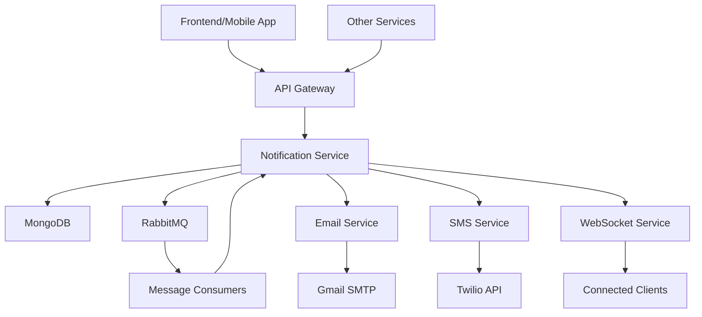

# 🏥 Hospital Management Notification Service - Usage Guide

## 📋 Table of Contents
1. [Overview](#overview)
2. [Service Architecture](#service-architecture)
3. [Data Flow](#data-flow)
4. [Integration Patterns](#integration-patterns)
5. [API Usage Examples](#api-usage-examples)
6. [Notification Types](#notification-types)
7. [Channel Configuration](#channel-configuration)
8. [Error Handling & Retries](#error-handling--retries)
9. [Best Practices](#best-practices)
10. [Monitoring & Analytics](#monitoring--analytics)

## 🎯 Overview

The Hospital Management Notification Service is a **multi-channel notification system** that delivers messages via:
- 📧 **Email** (Rich HTML templates)
- 📱 **SMS** (Text messages via Twilio)
- 🌐 **Web** (Real-time WebSocket notifications)

### Key Features
- ✅ **Synchronous & Asynchronous** processing
- ✅ **Rich templates** for appointment reminders & prescriptions
- ✅ **Automatic retry mechanism** for failed deliveries
- ✅ **Bulk notifications** for system announcements
- ✅ **Real-time delivery tracking** and status updates
- ✅ **Admin management** tools for monitoring & control

---

## 🏗️ Service Architecture



### Components
- **API Layer**: REST endpoints for external integration
- **Service Layer**: Business logic and notification processing
- **Message Queue**: RabbitMQ for async processing
- **Data Layer**: MongoDB for persistence and delivery tracking
- **Delivery Channels**: Email, SMS, and WebSocket services

---

## 🔄 Data Flow

### 1. **Synchronous Flow** (Immediate Processing)
```
Client Request → API Validation → Create Notification → Send Immediately → Response
```

### 2. **Asynchronous Flow** (Queue-based Processing)
```
Client Request → Queue Message → RabbitMQ → Background Processing → Delivery → Status Update
```

### 3. **Retry Flow** (Failed Delivery Recovery)
```
Failed Delivery → Retry Schedule → Queue Retry → Attempt Delivery → Success/Max Retries Reached
```

---

## 🔌 Integration Patterns

### Pattern 1: Direct API Integration
**Use Case**: Real-time notifications from web applications

```javascript
// Frontend JavaScript Example
const sendNotification = async (notificationData) => {
  const response = await fetch('http://localhost:3005/api/notifications', {
    method: 'POST',
    headers: {
      'Content-Type': 'application/json',
      'Authorization': 'Bearer ' + authToken
    },
    body: JSON.stringify(notificationData)
  });
  
  return response.json();
};

// Usage
await sendNotification({
  recipient_user_id: 'user_123',
  recipient_type: 'patient',
  title: 'Appointment Confirmed',
  message: 'Your appointment has been confirmed for tomorrow at 2:00 PM',
  type: 'appointment',
  priority: 'normal',
  channels: ['web', 'email']
});
```

### Pattern 2: Microservice Integration
**Use Case**: Integration with appointment or prescription services

```javascript
// Node.js Service Example
const NotificationClient = require('./notification-client');

class AppointmentService {
  async createAppointment(appointmentData) {
    // Create appointment logic...
    const appointment = await this.saveAppointment(appointmentData);
    
    // Send notification
    await NotificationClient.sendAppointmentReminder({
      recipient_user_id: appointment.patient_id,
      patient_name: appointment.patient_name,
      doctor_name: appointment.doctor_name,
      appointment_date: appointment.date,
      appointment_time: appointment.time,
      appointment_number: appointment.number,
      room_number: appointment.room
    });
    
    return appointment;
  }
}
```

### Pattern 3: Event-Driven Integration (RabbitMQ)
**Use Case**: Loose coupling between services

```javascript
// Publisher Service
const publishNotificationEvent = (eventType, data) => {
  rabbitMQ.publish('notification.queue', {
    type: eventType,
    timestamp: new Date(),
    data: data
  });
};

// Usage in different services
publishNotificationEvent('appointment_reminder', appointmentData);
publishNotificationEvent('prescription_ready', prescriptionData);
```

---

## 📚 API Usage Examples

### Basic Notification
```bash
curl -X POST http://localhost:3005/api/notifications \
  -H "Content-Type: application/json" \
  -d '{
    "recipient_user_id": "patient_123",
    "recipient_type": "patient",
    "title": "Test Notification",
    "message": "This is a test message",
    "type": "system",
    "priority": "normal",
    "channels": ["web", "email"]
  }'
```

### Appointment Reminder
```bash
curl -X POST http://localhost:3005/api/notifications/send-appointment-reminder \
  -H "Content-Type: application/json" \
  -d '{
    "recipient_user_id": "patient_456",
    "patient_name": "John Doe",
    "doctor_name": "Dr. Smith",
    "appointment_date": "2025-08-28",
    "appointment_time": "14:30",
    "appointment_number": "APT001",
    "room_number": "Room 201"
  }'
```

### Async Notification
```bash
curl -X POST http://localhost:3005/api/notifications/async \
  -H "Content-Type: application/json" \
  -d '{
    "recipient_user_id": "user_789",
    "recipient_type": "staff",
    "title": "Async Processing Test",
    "message": "This will be processed asynchronously",
    "type": "system",
    "priority": "high",
    "channels": ["web", "email", "sms"]
  }'
```

### Get User Notifications
```bash
curl "http://localhost:3005/api/notifications?userId=patient_123&page=1&limit=10"
```

### Mark as Read
```bash
curl -X PUT http://localhost:3005/api/notifications/notification_id_here/read \
  -H "Content-Type: application/json" \
  -d '{"userId": "patient_123"}'
```

---

## 📧 Notification Types

### 1. **Appointment Reminders**
- **Channels**: Email (Rich HTML), SMS, Web
- **Template**: Professional appointment details with hospital branding
- **Use Case**: 24h before appointment, day-of reminders

**Email Template Features**:
- Patient name personalization
- Doctor information
- Date, time, and room details
- Preparation instructions
- Contact information

### 2. **Prescription Ready**
- **Channels**: Email (Rich HTML), SMS, Web  
- **Template**: Prescription pickup notification with instructions
- **Use Case**: When pharmacy completes prescription

**Email Template Features**:
- Prescription number
- Pickup instructions
- Pharmacy hours
- Required documents
- Cost information

### 3. **System Alerts**
- **Channels**: Email, Web
- **Template**: System maintenance or emergency notifications
- **Use Case**: Maintenance windows, emergency broadcasts

### 4. **Bulk Notifications**
- **Channels**: Web, Email
- **Template**: Hospital-wide announcements
- **Use Case**: Policy changes, facility updates

### 5. **Custom Notifications**
- **Channels**: All (configurable)
- **Template**: Flexible content
- **Use Case**: Any custom hospital communication

---

## ⚙️ Channel Configuration

### Email Configuration
```javascript
// Environment Variables
EMAIL_HOST=smtp.gmail.com
EMAIL_PORT=587
EMAIL_SECURE=false
EMAIL_USER=your-email@gmail.com
EMAIL_PASSWORD=your-app-password
EMAIL_FROM="Hospital Management <noreply@hospital.com>"
```

### SMS Configuration (Twilio)
```javascript
// Environment Variables
TWILIO_ACCOUNT_SID=AC...
TWILIO_AUTH_TOKEN=your-auth-token
TWILIO_PHONE_NUMBER=+1234567890
```

### Channel Selection Logic
```javascript
// Automatic channel selection based on notification type
const getDefaultChannels = (type, userPreferences) => {
  switch(type) {
    case 'appointment':
      return ['web', 'email', 'sms']; // All channels for appointments
    case 'prescription':
      return ['web', 'email', 'sms']; // All channels for prescriptions
    case 'system':
      return ['web', 'email']; // Email + web for system alerts
    case 'emergency':
      return ['web', 'email', 'sms']; // All channels for emergencies
    default:
      return ['web']; // Web only for other types
  }
};
```

---

## 🔄 Error Handling & Retries

### Retry Configuration
```javascript
const retryConfig = {
  maxRetries: 3,
  retryDelays: [5, 15, 60], // minutes: 5min, 15min, 1hour
  enabledChannels: ['email', 'sms'] // Web is real-time, no retry needed
};
```

### Retry Flow
1. **Initial Attempt**: Immediate delivery attempt
2. **First Retry**: 5 minutes after failure
3. **Second Retry**: 15 minutes after second failure
4. **Final Retry**: 1 hour after third failure
5. **Permanent Failure**: Mark as failed after max retries

### Error Handling Examples
```javascript
// Handle delivery failures
try {
  await notificationService.sendNotification(data);
} catch (error) {
  console.error('Notification failed:', error);
  // Automatic retry will be scheduled
}

// Check delivery status
const status = await notificationService.getDeliveryStatus(notificationId);
console.log('Status:', status); // 'pending', 'sent', 'failed'
```

---

## 🎯 Best Practices

### 1. **Choose the Right Pattern**
- **Synchronous**: User-triggered actions (appointment booking confirmations)
- **Asynchronous**: Batch operations, scheduled reminders
- **Event-driven**: Loose coupling between microservices

### 2. **Channel Selection**
```javascript
// High Priority: Use all channels
channels: ['web', 'email', 'sms']

// Normal Priority: Web + Email
channels: ['web', 'email']  

// Low Priority: Web only
channels: ['web']
```

### 3. **Message Content**
```javascript
// Good: Clear, actionable content
{
  title: "Appointment Reminder - Tomorrow 2:00 PM",
  message: "Your appointment with Dr. Smith is scheduled for tomorrow at 2:00 PM in Room 201. Please arrive 15 minutes early.",
}

// Avoid: Vague, unclear content
{
  title: "Reminder",
  message: "You have something scheduled.",
}
```

### 4. **Template Usage**
- **Use templates** for standardized communications (appointments, prescriptions)
- **Use custom content** for unique messages
- **Include variables** for personalization

### 5. **Error Handling**
```javascript
// Always handle responses
const result = await fetch('/api/notifications', options);
if (!result.ok) {
  console.error('Notification failed:', await result.text());
}
```

---

## 📊 Monitoring & Analytics

### Health Check
```bash
curl http://localhost:3005/health
```

**Response:**
```json
{
  "status": "healthy",
  "database": {"mongodb": true},
  "messageQueue": {"rabbitmq": true},
  "uptime": 1234
}
```

### Retry Statistics
```bash
curl http://localhost:3005/api/notifications/admin/retry-stats
```

### Process Pending Retries
```bash
curl -X POST http://localhost:3005/api/notifications/admin/process-retries
```

### Delivery Analytics
```javascript
// Get user notification history
GET /api/notifications?userId=user_123&status=sent&type=appointment

// Get unread count
GET /api/notifications/unread-count?userId=user_123

// Bulk operations status
GET /api/notifications/admin/retry-stats?timeframe=24%20hours
```

---

## 🔧 Advanced Usage

### Custom Templates
```javascript
// Using template variables
const templateVariables = {
  patient_name: "John Doe",
  doctor_name: "Dr. Smith",
  appointment_date: "2025-08-28",
  appointment_time: "14:30",
  room_number: "201",
  special_instructions: "Please bring your insurance card"
};

await notificationService.createNotification({
  // ... other fields
  template_name: 'appointment_reminder',
  template_variables: templateVariables
});
```

### Bulk Operations
```javascript
// Send to multiple users
await notificationService.queueBulkNotification({
  recipient_user_ids: ['user1', 'user2', 'user3'],
  title: 'System Maintenance Notice',
  message: 'Scheduled maintenance tonight from 11 PM to 1 AM',
  notification_type: 'system',
  priority: 'high',
  channels: ['web', 'email']
});
```

### WebSocket Integration
```javascript
// Frontend WebSocket connection
const ws = new WebSocket('ws://localhost:3005/ws/notifications');

ws.onmessage = (event) => {
  const notification = JSON.parse(event.data);
  displayNotification(notification);
};
```

---

## 🚀 Integration Checklist

### For Frontend Applications
- [ ] Implement notification display UI
- [ ] Connect to WebSocket for real-time updates
- [ ] Add "Mark as Read" functionality
- [ ] Implement notification history view
- [ ] Add unread count indicator

### For Backend Services
- [ ] Define notification triggers (appointment created, prescription ready)
- [ ] Implement error handling for failed notifications
- [ ] Add retry logic for critical notifications
- [ ] Set up monitoring and alerting
- [ ] Configure appropriate channels per notification type

### For Mobile Applications
- [ ] Integrate push notification service
- [ ] Implement notification permissions
- [ ] Add notification action handling
- [ ] Sync with backend notification status

---

## 📞 Support & Troubleshooting

### Common Issues
1. **Emails not sending**: Check SMTP credentials and firewall settings
2. **SMS not working**: Verify Twilio credentials and phone number format
3. **High retry rates**: Check external service connectivity
4. **Performance issues**: Monitor RabbitMQ queue length

### Debug Commands
```bash
# Check service health
curl http://localhost:3005/health

# Test email delivery
node test-services.js

# Check retry statistics  
curl http://localhost:3005/api/notifications/admin/retry-stats

# Process pending retries manually
curl -X POST http://localhost:3005/api/notifications/admin/process-retries
```

---

**🎉 Your Hospital Management Notification Service is ready for production use!**

For additional support or custom integrations, refer to the API documentation or contact the development team.
